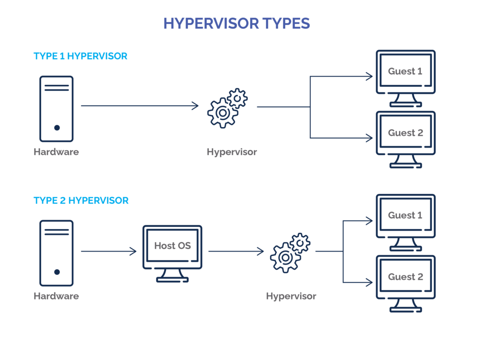

# Introducción a la Virtualización

## ¿Que es la virtualización?

La virtualización consiste en la tecnologia que permite al usuario la creación de entornos virtuales o simulados (guests) en un sistema fisico (host).

Esto se logra a partir de la creacion de las conocidas como **maquinas virtuales**.

## Que es una Maquina Virtual (VM)

Las VMs son instancias **aisladas** y **virtualizadas** de un sistema operativo, las cuales se despliegan sobre un servidor fisico. Cada VM tiene sus propios recursos virtuales (CPU, RAM, Almacenamiento, NISCs, etc...).

***Nota: aisladas significa que las maquinas no interactuan de ninguna manera con el host***

### Hipervisores
Consiste en un monitor de maquinas virtuales, en resumen, un proceso que crea y ejecuta VMs.

Hay dos tipos de Hipervisores:

* Tipo 1: conocidos como hipervisores **bare metal**, se ejecutan en el propio hardware fisico del host.
    * Ejemplos: Proxmox, VMWARE, **KVM**
* Tipo 2: Conocidos como alojados, se ejecutan como software del SO, en resumen son aplicaciones que realizan funciones de hipervisor. 
    * Ejemplos: Virtualbox, VMWare workstation, Parallels Desktop

## Tipos de Virtualización
* **Virtualización Total(Completa)**: se refire a la casi total simulacion del hardware real, permite al SO Guest ejecutarse sin modificaciones.
* **Virtualización Parcial**: No se simula todo el ambiente, puede requerir de cambios en el Guest.
* **Paravirtualización**: No se simula el ambiente. Cada guest se ejecuta en un **Dominio Aislado** como si se ejecutasen en sistemas separados. Siempre requiere modificaciones del Guest.

## Ventajas de la Virtualización
* Consolidación de servidores: permite ejecutar múltiprd VM en un solo server fisico, reduciendo costes.

* Uso eficiente de recursos: aprobechamos al maximo recursos hardware al asignarlos dinamicamente a las VM.

* Aislamiento: las maquinas se pueden mover entre servers fisicos sin interrupciones, facilitando disponibilidad y escalabilidad.

# Introducción a KVM

## Que es KVM
Consiste en una arquitectura de virtualización completa la cual hace uso de QEMU para emular hardware o caracteristicas de sistema.

Se presenta como una alternativa a sistemas de virtualización propietarios, apoyandose en Linux para crear una infraestructura completa de virtualización.

### Capacidades
* Conexion a cabinas de almacenamiento.
* Alta disponibilidad.
* Redundancia en tiempo real.
* Software libre.
* Requiere de disponer de un equipo con procesador de instrucciones de virtualización VT (Intel) o SVM (AMD)
* Permite realizar Paravirtualización por VirtIO
* Soporta **Overcommit**

***Nota: Overcommit es el uso de memoria excediendo memoria fisica del host***

### Componentes clave

* **KVM Kernel Modules (kvm.ko)**: 
    * Modulo que actua componente central
    * Gestiona la infraestructura de virtualización
    * Permite al SO Host actuar como hipervisor, creando y controlando maquinas virtuales.
    * Aprovecha extensiones de virtualización de hardware, facilitando la gestion eficiente de memoria.
* **Componende de espacio de usuario (QEMU)**:
    * Trabaja junto a kvm.ko dando soporte a virtualizacion completo
    * Emula hardware y facilita la ejecucion de VMs
    * Se puede usar desde una interfaz grafica (Virt-Manager)
    * Se puede usar por linea de comandos.

* **LivVirt**:
    * Toolkit para gestionar plataformas de virtualización
    * Contiene un demonio (LivVirtd) contiene mas erramientas de gestion y funciona como una API.
* **Virsh**: 
    * Aplicacion construida sobre la API de LivVirt
    * Alternativa a virt.manager sin entorno grafico
    * Basicamente contiene las herramientas de hipervisor para el SO
* **Virt-Manager**:
    * Entorno grafico con la herramientas para gestionar maquinas
    * Similar a proxmox o VMWare

El proyecto KVM ofrece dispositivos paravirtualizados llamados virtIO, que mejoran el rendimiento en operaciones de E/S, como red y discos duros, al ser más eficientes que los dispositivos emulados.

* **Ventaja**: Ofrecen un rendimiento casi real y son ideales para sistemas Linux, que los reconocen automáticamente.

* **Inconveniente**: No todos los sistemas operativos, como Windows, los soportan por defecto. Para usarlos en estos casos, es necesario instalar controladores adicionales durante la instalación del sistema operativo en la máquina virtual. 

### Caracteristicas de KVM
* **Seguridad**:
    * Cada maquina se implementa solo como proceso.
    * Aprobecha el modelo de seguridad de linux (AppArmor). Los procesos se encierran de manera que cuando se comprometa no afecte al sistema.
* **Gestion de Memoria**:
    * Hereda caracteristicas de question de memoria de linux.
    * Siendo las VM procesos Linux gestiona la memoria para los mismos como haria cualquier otro.
    * El soporte NUMA de linux permite otorgrar gran cantidad de memoria.
    * Usa KSM (same page merging) para la compartición de memoria.
* **Almacenamiento**:
    * Usa cualquier amacenamiento soportado por linux
    * Permite usar almacenamiento de imagenes en ficheros distribuidos, permitiendo compartirlas con otros HV
    * Permite el uso de QCOW2 para que no ocupen demasiado las maquinas. A parte de que permite snapshots, compresion y cifrado.
* **Live Migrations**:
    * Permite hacer migraciones en caliente, es decir, mover maquinas entre servidores sin interrupción del servicio.
    * Son completemante trasparentes pues la VM no se llega a apagar.
    * Permite almacenar el estado de la VM a disco, para su posterior reanidación.

* **Drivers**:
    * Virtualización hibrida:
        * Los SO guest se le instalan drivers paravirtualizados
        * Permiten el uso de interfaz E/S optimizada en vez de emular los dispositivos.
        * Mejora los ratios de rendiento en la E/S para dispositivos de bloques y NICs.
    * Utiliza el estandart VirtIO
* **VirtIO**:
    * Consiste en una interfaz independiente al hipervisor.
    * Esta diseñada para desarrollar drivers que puedan usar los HVs.
    * RedHat desarrollo drivers de VirtIO optimizados para E/S de red y disco para SO de Windows.

* **Rendimiento y escalabilidad**:
    * KVM posee los mismos rasgos de rendimiento y escalabilidad que caracteriza a Linux.
    * KVM soporta VM de hasta 16 CPUs virtuales y 256 GB de RAM.
    * El rendimiento de aplicaciones como SGBD Oracle, SAP, LAMP, MS Exchange sobre KVM puede oscilar entre el 95 % y el 135 % comparado con su ejecución en servidores físicos.
    * Se han conseguido ratios de hasta 600 máquinas virtuales en un solo servidor físico.
[⬅️ Volver al índice](./Index.md)
[⬆️ Volver al README](/README.md)
