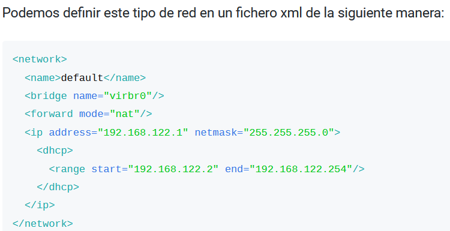
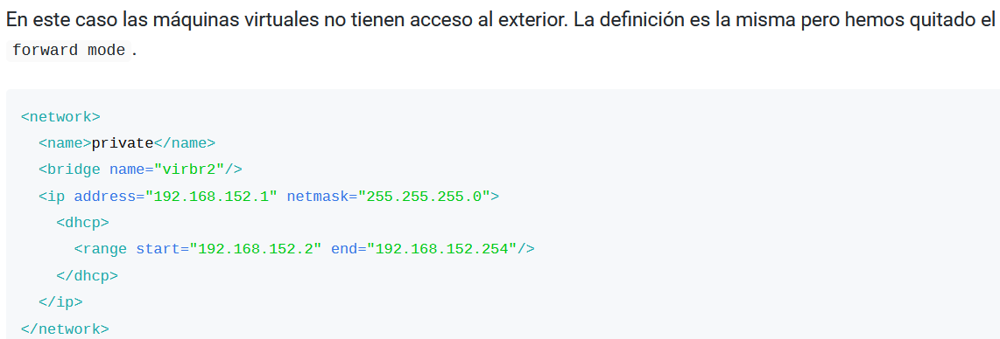

# Redes en KVM
## Introducción
Libvirt proporciona las herramientas necesarias para gestionar las redes de nuestras VMS

Podemos crear en dos grupos:
* Redes Virtuales (Privadas)
* Redes Puente (Publicas): la maquina estará conectada a la misma red que el host, esto haciendo uso de bridges externos.

***Nota: bridge es un dispositivo de interconexion de redes. En resumen un switch***

## Tipos de redes

### Redes Nat
* Red virtual Privada
* Se nos otorga un router/nat con conectividad al exterior
* La red **Default** de KVM es de este tipo
* Caracteristicas red Default:
    * Crea un bridge virtual (vmbr0).
    * En el bridge se conectan las maquinas.
    * En este bridge esta conectado el host.
    * Usa la ip del host para conectarse al exterior.
    * Las maquinas se configuran por DHCP de Default (192.168.122.2-254/24).
    * 192.168.122.1 es el host.
    * El host configura el server DNS de las VMs
    * El host hace funcion de router, se usa la interfaz del host con conexion al exterior para obtener acceso a internet.
    * El exterior no se puede comunicar con las maquinas, lo hace con la red puente.
    

### Red Virtual aislada (Isolated)
* Red privada
* No hay conectividad con el exterior
* Permite crear una red privada entre el hipervisor y las maquinas virtuales
* Ejemplo:
    * Host y maquinas conectados a switch vmbr1.
    * Host actua como dhcp.
    * Comunicacion entre host y maquinas en la red, pero las maquinas en red no pueden comunicarse con el exterior.



### Red Virtual Muy aislada
* Red Privada
* No hay conectividad con el exterior ni el host
* No hay servidor dhcp ni dns
* Red de las maquinas suele ser estatica

### Red Virtual Modo Abierto
* Las VM pueden accedeer a red externa de manera directa
* No hay NAT, la red es la misma que el host
* VMs tienen ip de la red externa y son acesibles desde otros dispositivos.

### Redes Puente conectadas a Bridge Externo
* Un bridge externo (br) es un switch virtual conectado al router de la red local.
* El host crea el bridge.
* El host esta conectado al bridge.
* Permite a las maquinas virtuales .conectarse al router directamente a traves del bridge.
* El paquete que nos permite trabajar con Linux Bridge: ````sudo apt install -y bridge-utils````

### Redes Puente compartiendo interfaz fisica del host
* Usa una conexion macvtap
* Permite conexion directa con la red fisica del NIC del host (sin bridge)
* No permite conexion entre host y guest

## La red por defecto de QEMU-KVM 
* Por defecto se crea una red virtual llamada **Default**
* Opera en modo NAT
* Tiene asociado el Bridge Virtual **VMBR0**
* La red tiene un servidor DHCP activado
    * Lo hace a traves del paqueta dnsmasq-base
    * El rango es entre 192.168.122.2 y 192.168.122.254
    * La 1 esta reservada para el host y servidor dns.
* El host es el NAT

## Comandos de Red
### Comandos basicos
~~~bash
# Asumimos que trabajamos con root, en caso contrario añadimos sudo
## Ver todas nuestras redes, muestra: nombre, estado, si se inicia automatico y si es persistente entre inicios de sesión
virsh net-list --all

## Creamos red a partir de xml
virsh define <red>.xml

## Iniciar una red
virsh net-start <red>

## Activar inicio en arranque
virsh net-autostart <red>

## Eliminar red
virsh net-undefine <red>
~~~
### Crear una red (default como base)
~~~bash
# Creamos una copia de default, la llamaremos mired2
virsh net-dumpxml default > mired2.xml

# Editamos mired2
## Intalamos y obtenemos una UUID
apt install uuid-runtime
uuidgen
## Generar nueva MAC
printf 'DE:AD:BE:EF:%02X:%02X\n' $((RANDOM%256)) $((RANDOM%256))DE:AD:BE:EF:07:92
## Acceso
nano mired2.xml

# Una vez configurada la definimos para que la identifique KVM se inicie y se autoarranque
virsh net-define mired2.xml
virsh net-start mired2
virsh net-autostart mired2

# Podemos consultar la red creada
nano /etc/libvirt/qemu/networks/mired2.xml
~~~
#### Resultado final
~~~xml
<network>
  <!-- Nombre de la red virtual -->
  <name>mired2</name>
  
  <!-- Identificador único de la red, lo sacamos con el comando  uuidgen-->
  <uuid>bba275f0-8866-4580-ad86-eb42e94c07fd</uuid>
  
  <forward mode='nat'>
    <nat>
      <!-- Rango de puertos NAT -->
      <port start='1024' end='65535'/>
    </nat>
  </forward>
  
  <!-- Configuración del puente -->
  <bridge name='virbr2' stp='on' delay='0'/>
  <!--Añadimos aquí la mac generada-->
  <mac address='52:54:00:2f:a3:d9'/>
  <domain name='mired2'/>
  
  <!-- Configuración de IP y DHCP -->
  <ip address='192.168.6.1' netmask='255.255.255.0'>
    <dhcp>
      <range start='192.168.6.2' end='192.168.6.254'/>
    </dhcp>
  </ip>
</network>
~~~
### Repaso de etiquetasa xml
* ``<name>``: nombre de la red
* ``<bridge>``: nombre del bridge virtual
* ``<forward>``: Indica que las maquinas tendran conexion con el exterior, si no se especifica el metodo es nat
    * router: dan acceso al exterior pero con encaminemiento del host y no Nat
    * open: Similar al anterior pero sin firewall.
* ``<ip>``: indica la direccion de IP y la mascaraa de la direccion del host. Permite al host conectarse.
    * ``<dhcp>``: elemento opcional, permite configurar el servidor dhcp
        * ``<range>``: permite dar rango al dhcp

## Creación de Linux bridge
Lo vamos a hacer por comandos, el bridge ha de ser creado en el host.
### Debian
~~~bash
nano /etc/network/interfaces
~~~
~~~pl
## Configuramos la interfaz como manual y de arranque automatico
auto enp3s0
iface enp3s0 inet manual

# Configuración del External bridge
auto br0
iface br0 inet dhcp ## Especificamos que funcione por dhcp
    bridge_ports enp3s0 ## Interfaz que vinculada
    bridge_stp off ## Desactivamos ell spanning tree
    bridge_fd 0 ## Desactivamos el delay para envio de datos de manera inmediata
    bridge_maxwait 0 ## Tiempo de espera maxima para la activación del bridge
~~~
~~~pl
## En caso de que queramos que la ip sea estatica
auto enp3s0
iface enp3s0 inet manual
# Configuración del External bridge
auto br1
iface br1 inet static
    network 172.26.0.0
    netmask 255.255.0.0
    address 172.26.0.100
    gateway 72.26.0.1
    broadcast 172.26.255.255
    bridge_ports enp3s0
    bridge_stp off
    bridge_fd 0
    bridge_maxwait 0
    hwaddress ether <mac> ## Mac de la interfaz a puentear
~~~
~~~bash
## Limpiamos posible configuración residual
systemctl restart networking
ip a flush <interfaz> ## En nuestro caso enp3s0
ip a flush br1
systemctl restart networking
~~~
Sabremos que esta todo configurado si al hacer ``ip a`` el bridge y la interfaz tienen la misma MAC.

### Ubuntu
~~~bash
nano /etc/netplan/01-network-manager-all.yaml
netplan apply ## Despues de tocar el archivo de configuración
~~~
#### Archivo
~~~pl
## Añadimos la siguiente configuración
network:
###Config de la red
    bridges:
        br0:
            dhcp4: yes ##Para dhco
            interfaces:
                - enp3s0
~~~
### Configuracion KVM para conectar bridge externo
Creamos fichero de red xml
~~~bash
nano virtual_bridge_network.xml
~~~
~~~xml
<network>
    <name>virtual_bridge_network</name>
    <forward mode="bridge"/>
    <bridge name="br0">
~~~
La iniciamos en KVM
~~~bash
virsh net-define virtual_bridge_network.xml
virsh net-start virtual_bridge_network
virsh net-autostart virtual_bridge_network
~~~

## Creacion macvtap
Creamos fichero de red xml
~~~bash
nano macvtap_network.xml
~~~
~~~xml
<network>
    <name>macvtap_network</name>
    <forward mode="bridge"/>
    <interface dev="enp3s0">
~~~
La iniciamos en KVM
~~~bash
virsh net-define macvtap_network.xml
virsh net-start macvtap_network
virsh net-autostart macvtap_network
~~~
Esta red usara la interfaz del host de manera directa para el acceso al exterior.

## Comandos de redes
~~~bash
# Habilita el inicio automático de una red
sudo virsh net-autostart <network-name>

# Crea una red de forma temporal desde su definición en XML
sudo virsh net-create <file.xml>

# Crea o actualiza una red inactiva de forma persistente desde su definición en XML
sudo virsh net-define <file.xml>

# Detiene una red
sudo virsh net-destroy <network-name>

# Muestra la información sobre el asignamiento de IP temporal asociado a una red
sudo virsh net-dhcp-leases <network-name>

# Imprime el XML de definición de una red
sudo virsh net-dumpxml <network-name>

# Permite editar de forma interactiva el XML de definición de una red
sudo virsh net-edit <network-name>

# Muestra el log y los eventos producidos para una red
sudo virsh net-event <network-name>

# Muestra la información sobre una red
sudo virsh net-info <network-name>

# Muestra un listado con las redes disponibles
sudo virsh net-list

# Convierte el UUID de una red a su nombre
sudo virsh net-name <network-uuid>

# Inicia una red previamente definida y en estado inactivo
sudo virsh net-start <network-name>

# Elimina una red persistente
sudo virsh net-undefine <network-name>

# Actualiza alguna parte de la configuración de una red
sudo virsh net-update <options> <network-name>

# Convierte el nombre de una red a su UUID
sudo virsh net-uuid <network-name>

# Muestra los puertos de una red
sudo virsh net-port-list <network-name>

# Crea un puerto de red a través de su definición en un fichero XML
sudo virsh net-port-create <file.xml>

# Imprime la información de un puerto de red en XML
sudo virsh net-port-dumpxml <port-name>

# Elimina el puerto de red especificado
sudo virsh net-port-delete <port-name>

# Listado de interfaces físicas que existen
sudo virsh iface-list

# Información detallada de la red 'default'
sudo virsh net-info default

# Estado de la red 'default' (y de todas las redes)
sudo virsh net-list --all
~~~
[⬅️ Volver al índice](./Index.md)
[⬆️ Volver al README](/README.md)
