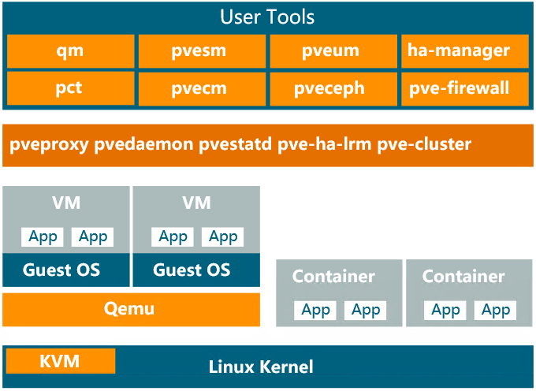
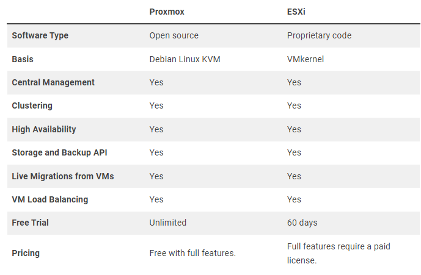

# Introducción a Proxmox

Proxmox en un software de virtualización diseñado para crear un servidor de maquinas virtuales. 

**[Documentación](DATA/DOC.html)**

## Caracteristicas de Proxmox

* **Interfaz grafica GUI**
* **Soporte (experimental) con Ceph Reef y Quincy**
* **Actualizaciones en ZFS**
* **Itegracion con tecnologias red**
* **MSoporte para tpm y cifrado de discos**
* **Soporte para UEFI**
* **Soporte para ARM**

### Caracteristicas de uso
* Migracion en caliente
* Cluster de alta ddisonibilidad
* Manejo de tarjetas fisicas por bridges
* Cluester sin Single Point OF Failure (SPOF)
* Autentificacion

## Arquitectura 

## Comparativa entre software similar

## Requisitos Minimos

* **Ram: 16GB**
* **Procesaodor multinucleo**
* **Almacenamiento rapido SAS en Raid**
* **NAS para copias de seguridad**

## El entorno

Proxmox se  basa en un centro de datos, el cual refiere al resto de la configuracion generica (/etc/pve/), dentro de ese centro de datos se encuentran los distintos nodos.

### Configuracion del centro de datos

* **Buscar**: Buscar info especifica de sistema
* **Notas**: Puedes hacer notas en formato MARKDOWN (.md) para completar la información.
* **Cluster** 
* **Ceph**: Almacenamiento distribuido
* **Opciones**
* **Storage**: informacion de almacenamiento (/var/lib/vz).
    * **Local**: Copias de seguridad, isos, plantillas de contenedores.
    * **Local-lvm**: Discos duros, de maquinas virtuales y contenedores, es un volumen logico de tipo Thin (No ocupa inmediatamente todo el almacenamiento reservado).
* **Backup**:
* **Replication**:
* **Permisos**: dividido en subconfiguraciones.
    * **Usuarios**
    * **Tokens de API**
    * **Grupos**
    * **Pools**
    * **Roles**
* **ACME**: Configurar certificados  acme
* **Cortafuegos**:
* **Metricas**: Configura metricas externas al proxmox.
* **Resource Mappings**: Para configurar entradas USB etc.
* **Notificaciones**: crear y configurar notificaciones.ç

**Comandos interesantes**:

* **qm**
* **pct**
* **pvesh**

### Nodos

Un nodo no es mas que un servidor, con los nodos puedes montar una infrastructura dentro del proxmox, ya sea para hacer copias de seguridad, compartir recursos o balancear cargas.

En el entorno gracico se pueden ver las siguients **configuraciones:**

* **Buscar**: Buscar info especifica de sistema
* **Notas**: Puedes hacer notas en formato MARKDOWN (.md) dentro  de los nodos para añadir mas información.
* **Shell**: muestra la conssola de la maquina fisica
* **Sistema**: contiene las siguientes configuraciones de sistema a parte de mostrar los servicios de proxmox:
    * **Red**: Configuraciones de red, de base contiene una red fisica y un bridge virtual (activo y con autoinicio) el cual esta enlacado a la interfaz fisica que seleccionaste en la instalación.
    * **Certificados**
    * **DNS**
    * **Hosts**: fichero /etc/hosts
    * **Opciones**: Opciones generales
    * **Horario**: Timezone del Nodo
    * **Registros del sistema**: Historial de eventos dentro del nodo
* **Actualizaciones**: Hay que tener cuidado, puedes perder la configuraciones del nodo.
* **Repositorios**: Repositorios del sistema, para cargar determinados repositorios tienes que tener una subscripcion.
* **Discos**: Particiones y discos del nodo.
* **Ceph**: Almacenamiento distribuido
* **Replicación**
* **Historial de tareas**

## Directorios importantes

* **Directorrio de ISOS**: /var/lib/vz/template/iso

[⬅️ Volver al índice](./Index.md)
[⬆️ Volver al README](/README.md)
