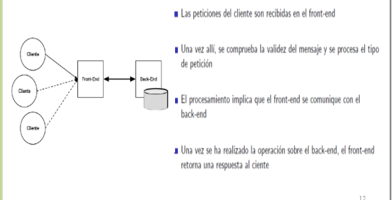
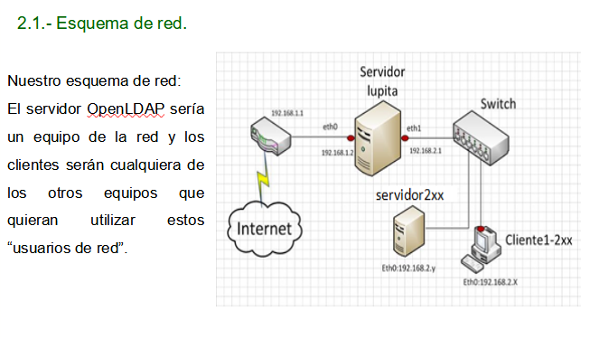
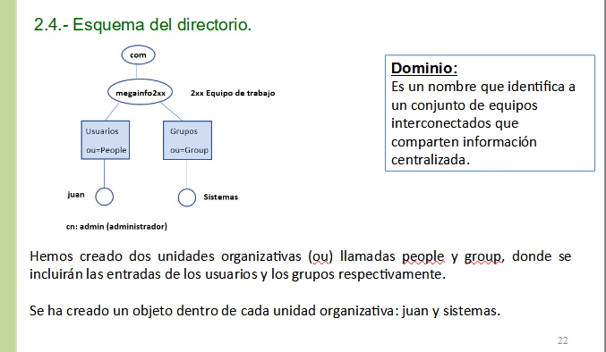
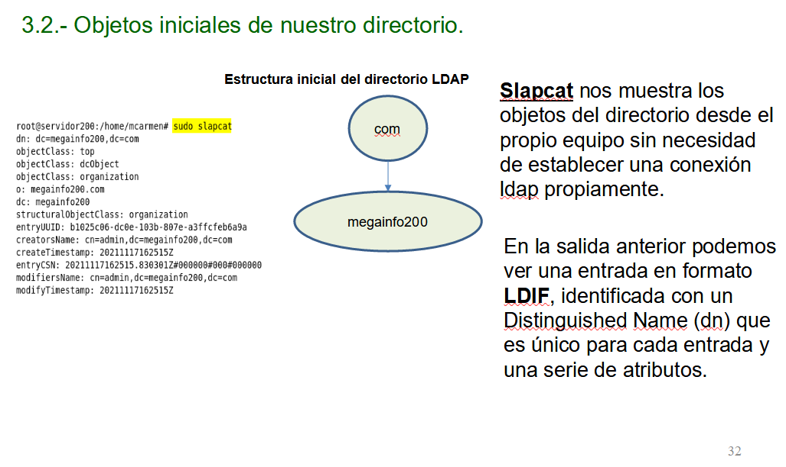
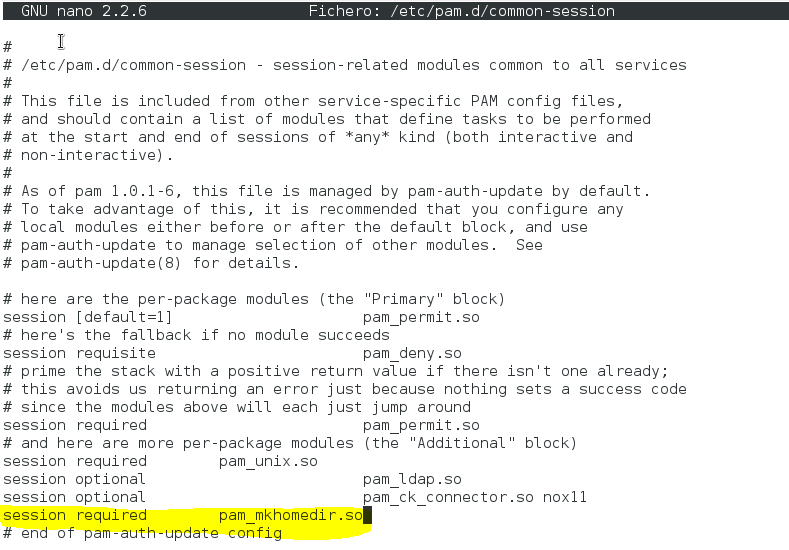
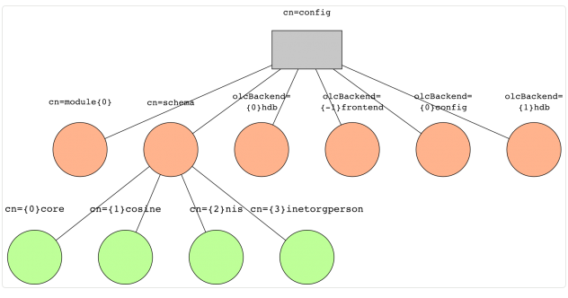

# Instalacion y configuracion de ldap
## Introducción

### Antecedentes
EL protocolo Nis fue creado por Sun Microsystems para el envio de datos en sistemas distribuidos. Consiste en un protocolo de servicio de directorios cliente-servidor. (Vale para contraseñas, usuarios, etc)

* Se solia usar para autenticación centralizada en el servidor. 
* No es compatible con TCP/IP.
* No cifra la info transmitida.

Debido a estas causas esta en desuso.

Actualmente se utiliza LDAP como reemplazo.
* Funciona sobre TCP/IP
* Cifra el canal de comunicación.
* Guarda todo tipo de datos: usuarios, correos, telefonos, impresosras, PCs, etc...

### Que es LDAP?
* Lightweight Directory Access Protocol
* Capa de Aplicacion del modelo OSI-TCP
* Mantiene y distribuye info para otros protocolos de la capa de aplicación.
* Consiste en un servicio para almacenar y distribuir información acerca de usuarios, grupos, redes, servicios, hosts, roles e información de otras aplicaciones de manera **consistente** a través de la red.

## Open LDAP
### Que ess?
* Implementación libre de LDAP
* Licencia publica:
    * Aprobada por entidades reguladoras FSF
    * Compatible con GPL
* Esta integrado con una gran cantidad de distribuciones de Linux.

### Caracteristicas
* Basado en slapd (demonio)
* Servicio permanente durante inicio de sistema
* Hay varios programas que actuan como clientes del servicios:
    * ldapsearch: motor de consultas
    * ldapadd: para insertar datos
    * ldapdelete: borrados

### Arquitectura
* Dividido en dos modulos:
    * FrontEnd: gestiona conexiones y procesado del protocolo
    * Backend: gestion de almacenamiento
* Separa el almacenamiento de las comunicaciones
* Se pueden tener multiples backends:
    * Bases de datos relacionales
    * Archivos de texto plano
    * Redireccion de peticiones a otros destinos (proxy)

## Backends
Un backend es una clase de interfaz de almacenamiento, una bd es una instancia de un backend.

El server Slapd puede usar varios Backends simualtaneamente para sus procesos: 

* Backends de almacenamiento de datos (Data Storage backends) - estos realmente almacenan información 
    * back-bdb: el primer backend transaccional para OpenLDAP, construido para BerkeleyDB
    * back-hdb: una variante de back-bdb que es totalmente jerárquica y soporta renombrado de sub-árboles
    * back-ldif: construido en archivos LDIF de texto plano
    * back-ndb: un backend transaccional construido para el motor de cluster NDB de MySQL
* Proxy backends - actúan como puertas de enlace a otros sistemas de almacenamiento de datos 
    * back-ldap: proxy simple a otros servidores LDAP
    * back-meta: proxy con características de meta-directorio
    * back-passwd: usa un sistema basado en Unix de datos passwd y group
    * back-relay: internamente redirige a otros backends de servidores slapd
    * back-sql: establece conexiones a bases de datos SQL
* Backends dinámicos - estos generan datos sobre la marcha 
    * back-config: configuración del servidor slapd vía LDAP
    * back-dnssrv: localiza servidores LDAP vía DNS
    * back-monitor: estadísticas de slapd vía LDAP
    * back-null: un backend nulo, análogo a /dev/null en Unix
    * back-perl: invoca arbitrariamente módulos de perl en respuesta a peticiones LDAP
    * back-shell: invoca scripts de shell para peticiones LDAP
    * back-sock: redirige peticiones LDAP sobre IPC a demonios de manera arbitraria

## Configuracion servidor LDAP

1. Ponemos la ip estatica y reiniciamos networking
2. Nos aseguramos de que los repositorios esten configurados
3. Cambiamos el hostname al que queramos para nuestra organización (servidorxxx.megainfoxxx.com) y configuramos la dns de localhost.
4. `apt update && apt upgrade`

***Nota: esquma de directorio que vamos a configurar***

5. `apt install slapd ldap-utils`
6. Introducimos los campos necesarios en la instalación

### Objetos iniciales de la configuracón

Con `slapcat` podremos ver la estructura completa de nuestro esquema realizado

### Formato Ldif
* Es el formato de documento usado para importación, modificación y exportación de datos independientemente del servidor.
* Cada server tiene una o varias maneras de almacenar info, con .ldif podemos unificar las visualizaciones y tratado de datos.
* Texto ACII
* Permite traslado de datos entre servidores.

***Nota ejemplo de estructura:***
~~~ldif
dn: uid=jperez,ou=People,dc=ejemplo,dc=com
uid: jperez
cn: Juan Perez
objectclass: account
objectclass: posixAccount
objectclass: top
loginshell: /bin/bash
uidnumber: 512
gidnumber: 300
homedirectory: /home/jperez
gecos: Juan Perez,,,,
userpassword: {crypt}LPnaOoUYN57Netaac
~~~

### Busqueda en directorios
~~~bash
# Devuelve campos "dn", -LL quita comentarios
ldapsearch -LL -x -b "dc=megainfoxxx,dc=com" "dn"
## -x autenticacio simple
## -b ruta por la que parte la busqueda "dc=megainfoxxx,dc=com"
~~~

#### /etc/ldap/ldap.conf
Configuracion de dominio, no hace falta parar el servicio para editar.
~~~
#
# LDAP Defaults
#

# See ldap.conf(5) for details
# This file should be world readable but not world writable.

BASE    dc=megainfo202,dc=com
URI     ldap://localhost ldap://servidorxxx.megainfoxxx.com

#SIZELIMIT   12
#TIMELIMIT   15
#DEREF       never

# TLS certificates (needed for GnuTLS)
TLS_CACERT   /etc/ssl/certs/ca-certificates.crt
~~~

### Creacion de nuestra estructura de directorios
1. Creamos base.ldif `nano base.ldif`

~~~ldif
dn: ou=people, de=megainfo200,de=com
ou: people
ObjectClass: top
ObjectClass: organizationalUnit

dn: ou=group , de=megainfo200,de=com
ou: group
ObjectClass: top
ObjectClass: organizationalUnit

~~~

2. Ejecutamos `ldapadd -x -W -D "cn=admin,dc=megainfo2xx,dc=com" -f base.ldif`
    * -x: auth simple
    * -D: usuario
    * -W: nos pedira contraseña
    * -f fichero a usar

3. Creamos grupo sistemas: `nano sistemas.ldif`
~~~ldif
dn: cn=sistemas,ou=group,dc=megainto200,dc=com
objectClass: posixGroup
objectClass: top
cn: sistemas
gidnumber: 2000
~~~

4. Creamos usuario juan: ``nano juan.ldif``

~~~ldif
dn: uid=juan, ou=people,dc=megainfoxxx,dc=com
ObjectClass: top
ObjectClass: posixAccount
ObjectClass: inetOrgPerson
objectClass: shadowAccount
uid: juan
sn: fernandez
givenName: juan
cn: juan fernandez
uidNumber: 2000
gidNumber: 2000
userPassword: {MD5}bpkHwv3yetSoVOVK@3A0Ka:
homeDirectory: /home/juan
loginShell: /bin/bash
mail: juan@gmail.com
jpegPhoto:: /dir/image
~~~

Para crear el contenido del atributo userPassword hemos utilizado ``slappasswd -h {MD5}``. Utiliza el algoritmo de cifrado MD5

Si un atributo contiene valores no ASCII, como por ejemplo una imagen JPEG, se codifica en formato Base64. La opción –w 0 nos codifica todos los caracteres.

Comando: `base64 -w 0 imagen_juan.jpg`, despues copiamos el codigo y lo usamos en el ldif

### Directorio para usuario
~~~bash
mkdir -p /home/juan
cp -r /etc/skel/.* /home/juan
chown -R 2000:2000 /home/juan
~~~

### Configuracion ficheros pam
``nano /etc/pam.d/common-session``

Si todo ha ido bien, debemos ser capaces de entrar en cliente con la cuenta del usuario juan, que se autenticará sobre el servidor LDAP.

### Revisión base de datos
La  base de datos está en /var/lib/ldap.

* Las bases de datos pueden ser respaldadas en caliente gracias a slapcat.
* Si no te fias para el servicio antes de tocar nada.

* Copia de datos: `sudo slapcat -b dc=megainfoxxx,dc=com -l respaldo-dc=megainfoxxx,dc=com-$(date  +%d-%b-%Y).ldif`
    * -b: especifica dominio
    * -l: fichero de destino

* Restauracion:
    * Apaga el servicio primero
    * `slapadd -v -b dc=example,dc=com -l respaldo-dc=example,dc=com-$(date  +%d-%b-%Y).ldif`

### Esquemas
En ese directorio(/etc/ldap/slapd.d) se encuentra los distintos ficheros de configuración y esquemas

* Todo el arbol de LDAP se genera por esquemas, definiendo clases y atributos.
* La clase posixAccount que nos permitirá añadir los campos homeDirectory, loginShell, etc. 
* Todos los objectClass y atributos están definidos dentro de los esquemas.
* Un atributo definido en un esquema por un objectClass puede ser definido en otro esquema.