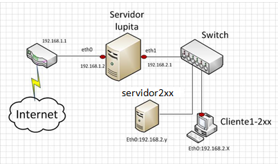

# Instroducción
## Antecedentes
### NIS
Servia para la autenticacion centralizada de usuarios en una red local, desgraciadameente no usa TCP/IP por lo que no se cifra la informacion, ahora esta en desuso.

OpenLDAP funciona sobre TC/IP lo que lo hace la alternativa mas deseable

## Definicion
* LDAP es un protocolo de aplicacion y transmite protocolos por la capa de 
* OpenLDAP cnsiste en la version libre de este protocolo. 
* Se basa en el programa slapd (daemon).
* Es un servicio permanente durante el inicio del sistema.
* Clientes/Comandos: 
    * ladpsearch: busqueda y cnsultas
    * ldapdd: inserciones
    * ldapdelete: borrados
* Todas las tranbsaccionees se realizan por comandos, no hay ficheros de configuracion que se deban tocar.

## Arquitectura
* Dividida en dos modulos
    * Back-end: 
        * Gestion de almacenamiento
        * Puede haber varios backend
    * Front-end
        * Conexiones
        * Procesado del protocolo

* Orden de accion
    1. Cieente hace peticion al front end
    2. Se valida eel mensaje y se enva al back-end
    3. Front end recibe respuesta y la envia al cliente

### Esquema dde red basico
