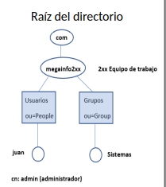

# Instroducción
## Antecedentes
### NIS
Servia para la autenticacion centralizada de usuarios en una red local, desgraciadameente no usa TCP/IP por lo que no se cifra la informacion, ahora esta en desuso.

OpenLDAP funciona sobre TC/IP lo que lo hace la alternativa mas deseable

## Definicion
* LDAP es un protocolo de aplicacion y transmite protocolos por la capa de 
* OpenLDAP cnsiste en la version libre de este protocolo. 
* Se basa en el programa slapd (daemon).
* Es un servicio permanente durante el inicio del sistema.
* Clientes/Comandos: 
    * ladpsearch: busqueda y cnsultas
    * ldapdd: inserciones
    * ldapdelete: borrados
* Todas las tranbsaccionees se realizan por comandos, no hay ficheros de configuracion que se deban tocar.

## Arquitectura
* Dividida en dos modulos
    * Back-end: 
        * Gestion de almacenamiento
        * Puede haber varios backend
    * Front-end
        * Conexiones
        * Procesado del protocolo

* Orden de accion
    1. Cieente hace peticion al front end
    2. Se valida el mensaje y se enva al back-end
    3. Front end recibe respuesta y la envia al cliente

## Comandos basicos

`ldapsearch`: para búsquedas y consultas
    `-LL`: Reduce la verbosidad de la salida al imprimir menos información adicional, mostrando los datos en un formato más limpio y legible
    `-x`: autenticacion simple
    `-b "dc=megainfo202,dc=com"`: Especifica la base de búsqueda (Base DN, Distinguished Name). En este caso, la base del árbol LDAP donde comenzará la consulta es dc=megainfo202,dc=com, que representa un dominio llamado megainfo202.com
    `"<criterio>"`: Especifica el filtro de búsqueda

`ldapadd`: para inserciones
    `-x`: autenticacion simple, coje el usuario y pide contraseña
    `-W`: indicas la contraseña
    `-D`: indicas usuario
    `-f`: indicas que usas un directorio .ldif para la inserción 

`ldapdelete`: para borrados
`slapcat`: devuelve toda la estructura actual
`slappasswd`: generar contraseña encriptada
    `-s <contraseña>`: le especifica contraseña a encriptar
    `-h <metodo>`: configura método de encriptado

~~~bash
# Ejemplos
ldapadd -x -W -D cn=<usuario>,dc=<nombredominio>,dc=com -f <Directorio> # Añades los grupos y estructuras de <Directorio> pasando <usuario> y te pedira la contraseña.
slappasswd -s 12345 -h {MD5} # Encripta con MD5 la contraseña '12345'

ldapsearch  -LL -x -b "dc=megainfo202,dc=com" "dn" # Busqueda de todo dentro de dominio megainfo202.com, "dn" resume las salidas a las lineas dn:

ldapmodify -x -W -D cn=admin,dc=megainfo202,dc=com -f modificacion.ldif # Modificacion de perfil por fichero
~~~
modificacion.ldif:
    ~~~nano
    dn: uid=juan,ou=people,dc=megainfo202,dc=com
    changetype: modify
    replace: mail
    mail: juand@.educaand.es
    ~~~
Fuchero de usuario juan.ldif:
~~~nano
dn: uid=juan,ou=people,dc=megainfo202,dc=com
ObjectClass: top
ObjectClass: posixAccount
ObjectClass: inetOrgPerson
ObjectClass: shadowAccount
uid: juan
sn: fernandez
givenName: juan
cn: juan fernandez
uidNumber: 2000
gidnumber: 2000
userPassword: {MD5}gnzLDuqKcGxMNKFokfhOew==
homeDirectory: /home/juan
loginShell: /bin/bash
mail: juan@gmail.com
jpegPhoto:: <codigo base64>
~~~
Comandos configurar juan:
~~~bash
mkdir /home/juan
cp -r /etc/skel/.* /home/juan
chown -R 2000:2000 /home/juan
~~~

### Esquema de red basico

---
* cn=admin
* dc=megainfo2xx
* dc=com
* uid=juan
* ou=People
* dc=megainfo2xx
* dc=com

[⬅️ Volver al índice](./Index.md)
[⬆️ Volver al README](/README.md)
