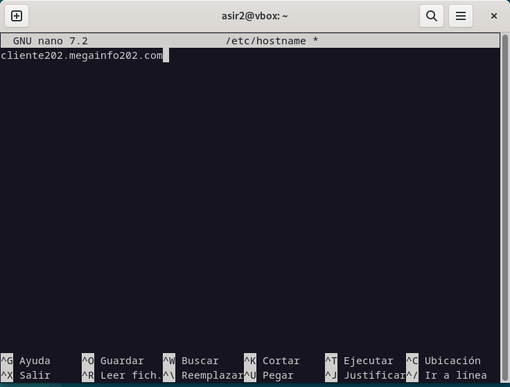
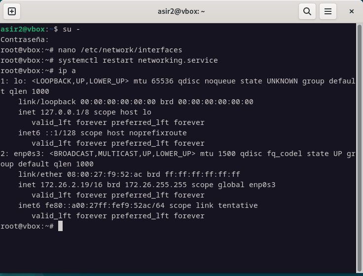
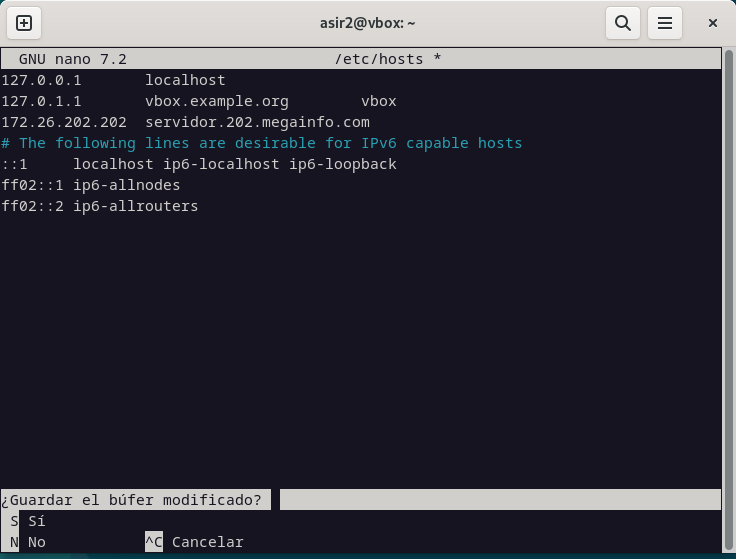
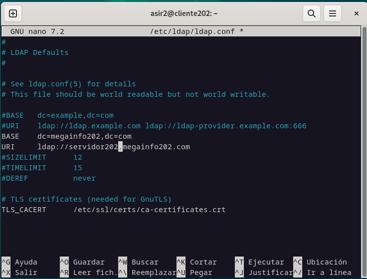
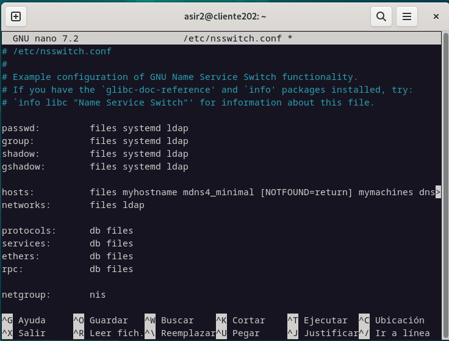
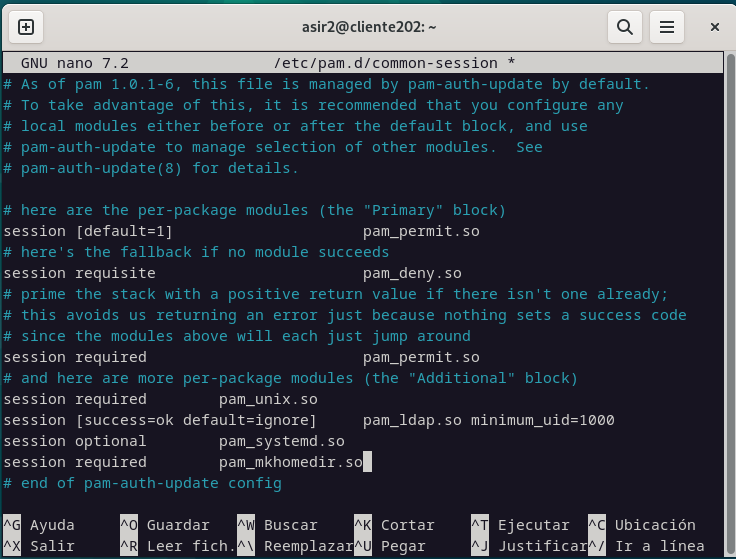
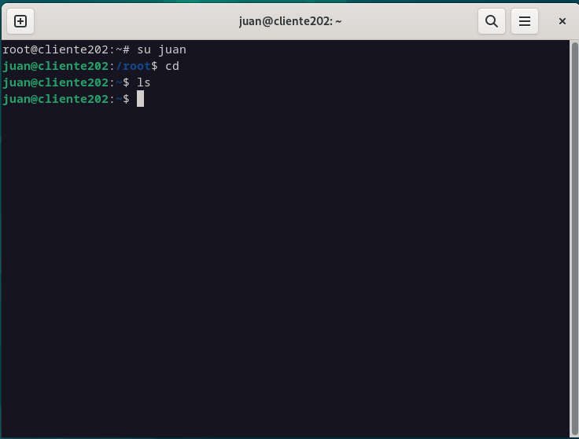

# Configuracion del cliente

## Pasos previos
**1. Configuramos el nombre del host a clientex.dominio.com**

**2. Configuramos una ip estatica.**

**3. Revisamos los repositorios de debian para que contenga los necesarios.**

**4. En hosts, resolvemos el nombre del servidor.**

## Instalacion de paquetes
~~~bash
apt install libnss-ldap libpam-ldap nscd
# Durante la instalacion especificamos el nombre del servidor como URI de server
~~~
~~~bash
nano /etc/ldap/ladp.conf
# Añadimos base y uri igual que een eel servidor
# BASE    dc=megainfo202,dc=com
# URI     ldap://servidor202.megainfo202.com
~~~

~~~bash
nano /etc/nsswitch.conf 
# Añadimos "ldap" al final de passwd,group, shadow, gshadow, hosts, networks
~~~

~~~bash
## Realizamos comprobaciones, tienen que aparecer los usuarios y grupos creados en el servidor
getent passwd
getent group
~~~

~~~bash
nano /etc/pam.d/common-session
# Añadimos linea al final
# session required        pam_mkhomedir.so
~~~

~~~bash
# Comprobacion final
su <usuario_server>
cd ## Si tiene directorio home todo va ien
~~~

***Nota: el servidor debe de estar activo, especialmente en las comprobaciones finales.***
[⬅️ Volver al índice](./Index.md)
[⬆️ Volver al README](/README.md)
