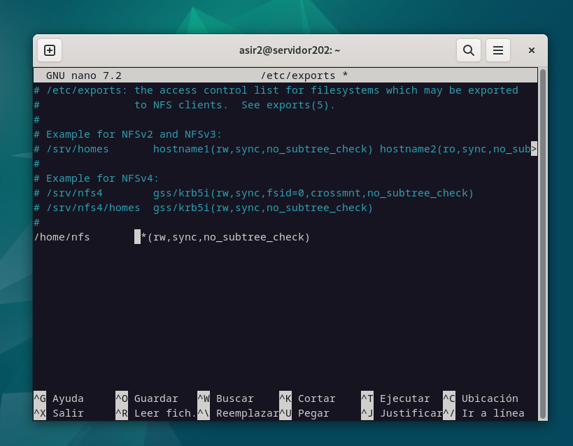
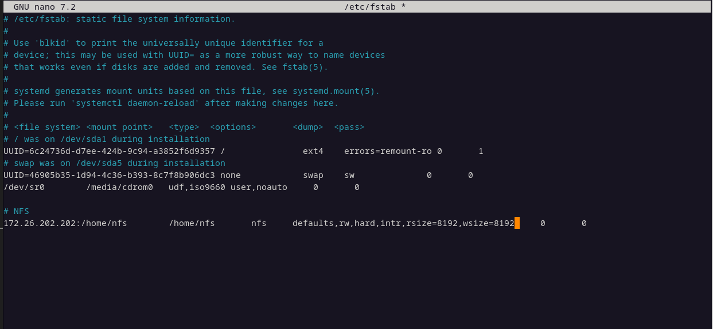
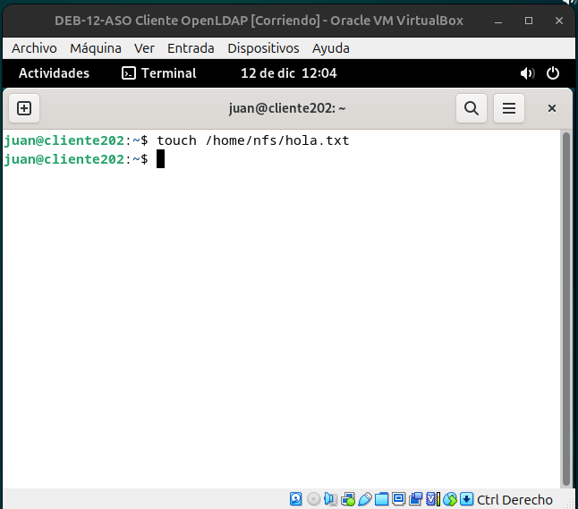
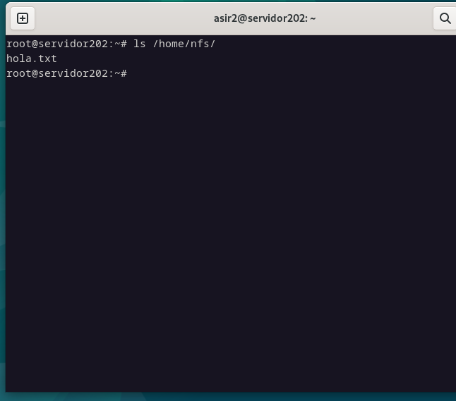

# Compartir carpeta en red local gracias a LDAP y NFS

## Pasos
1. `apt update && upgrade`
2. `apt install nfs-kernel-server`
2. `mkdir /home/nfs` `chmod 777 /home/nfs`
4. Editamos archivo de exportaciones: `nano /etc/exports`
    * Añadimos la siguiente linea: 

4. Reiniciar el servicio NFS:
~~~bash
exportfs -rva
systemctl restart nfs-kernel-server
showmount --exports localhost
## Encaso de necesitar de abrir puertos
sudo ufw allow from [IP_de_los_equipos] to any port nfs
~~~

5. En el cliente se ha de instalar nfs-common: `apt-get install nfs-common`

6. `showmount --exports 172.26.202.202`

7. Creamos la carpeta donde montar `mkdir /home/nfs`, para montar automaticamente: `nano /etc/fstab`

8. `mount -a` `systemctl daemon-reload`

## Comprobación

1. Nos loggeamos como juan en el cliente y creamos un archivo en la carpeta compartida.

2. Vamos al servidor y vemos si se ha creado el archivo

[⬅️ Volver al índice](./Index.md)
[⬆️ Volver al README](/README.md)
