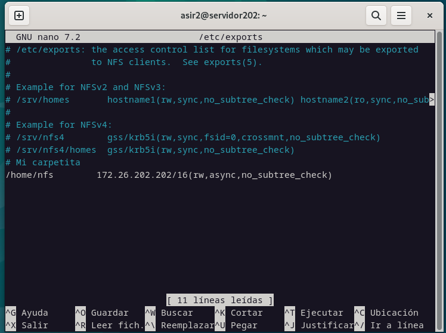

# Compartir carpeta en red local gracias a LDAP y NFS

## Pasos
1. `apt update && upgrade`
2. `apt install nfs-kernel-server`
3. Editamos archivo de exportaciones: `nano /etc/exports`
    * Añadimos la siguiente linea: `/home/nfs        *(rw,sync,no_subtree_check)`

4. Reiniciar el servicio NFS:
~~~bash
exportfs -ra
systemctl restart nfs-kernel-server

## Encaso de necesitar de abrir puertos
sudo ufw allow from [IP_de_los_equipos] to any port nfs
~~~

5. En el cliente se ha de instalar nfs-cpmmon:`apt-get install nfs-common`

