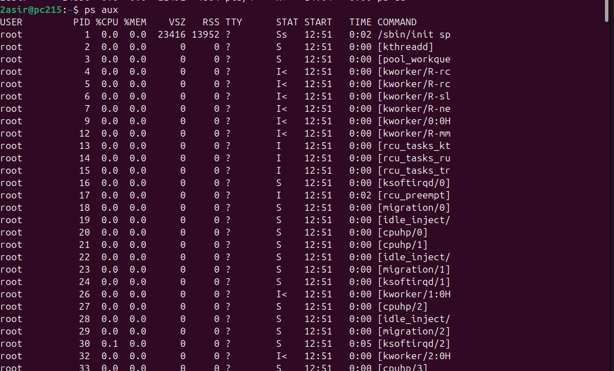

# Introducción a la Monitorización

## Que se monitoriza
* **Red**
* **Procesos**
* **Memoria**
* **Disco**

## Monitorización de procesos

### Comanddos
~~~bash
ps # Muestra procesos
top # Vision en tiempo real
htop # Version mas visual de top
atop # Muestra procesos en una fecha
~~~
* **ps -au**:  Ver todos los procesos de manera detallada
    * -a: todos los procesos de usuario
    * u: informacion detallada 
    * -C `<programa especifico>`: info de proceso especifico
    * -x: info de los demonios
    * -o `<cabeceras de procesos>`: permite alterar que columnas muestra
    * -e: muestra todos los procesos
    * --sort `[-/+<cabecera>]`: orden de salida

***Nota: añade  `| head -n <num>` para filtrar cuantos procesos aparecen;***

* **top**: se maneja en vivo pulsando botones.
    * -b > `<>`:no interactivo, guarda en un fichero
    * -n `numero`: itera `numero` veces
    * -o `[-/+<cabecera>]`: ordena por cabecera.

***Nota: top -b -n3 -o -%CPU | head -n 17. Filtra por uso de cpu*** 
* **htop**: mucho mas grafico, se controla de manera interactiva.
* **atop**:
* jobs: muestra lo que esta en segundo plano.
* kill -9  `<id_proceso>/%<idproceso>`: mata proceso, % mata los que se muestre en jobs.
* pkill `<nombre_proceso>`: mata todos los procesos con ese nombre

***Nota: ejecutar comando con '&' lo ejecuta en segundo plano;***
[⬅️ Volver al índice](./Index.md)
[⬆️ Volver al README](/README.md)
