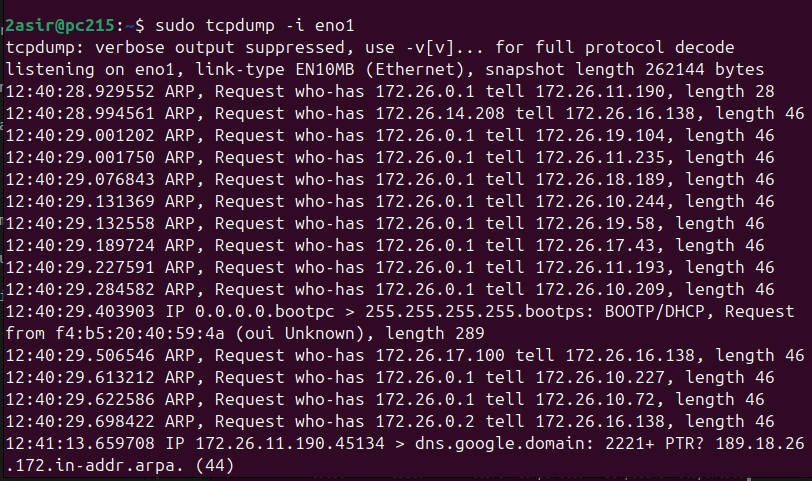
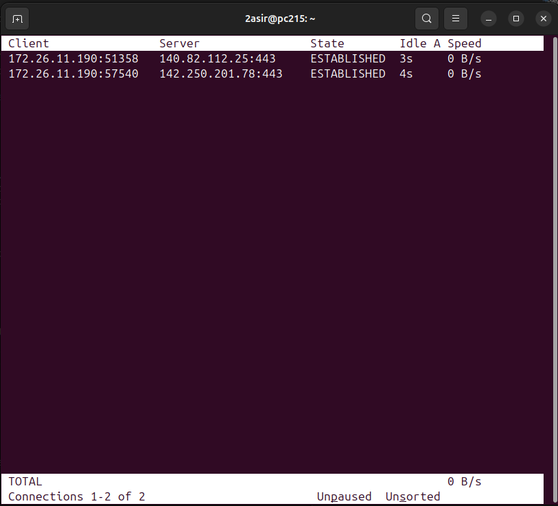
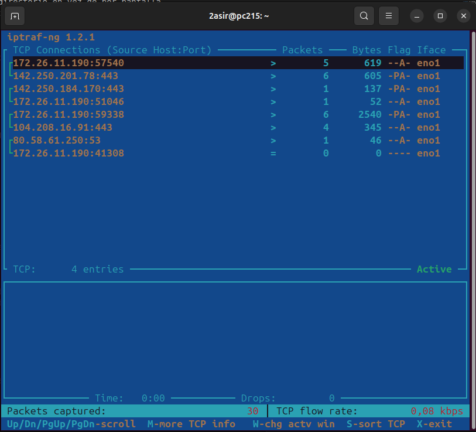
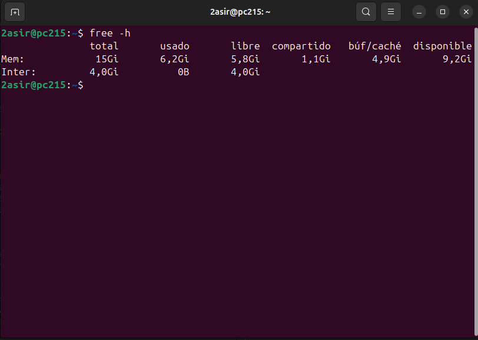
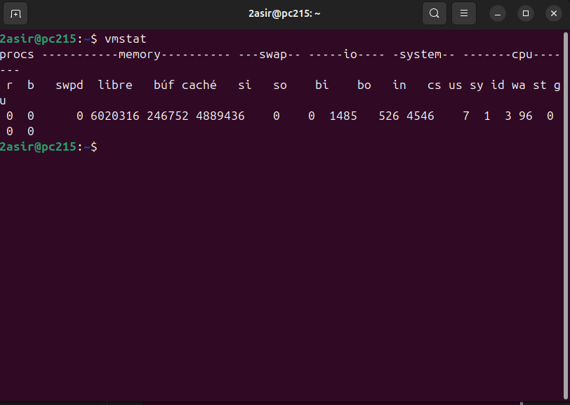
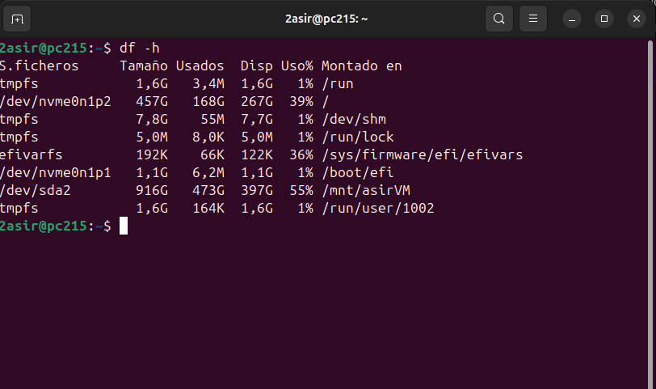
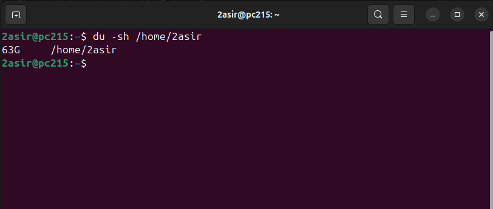
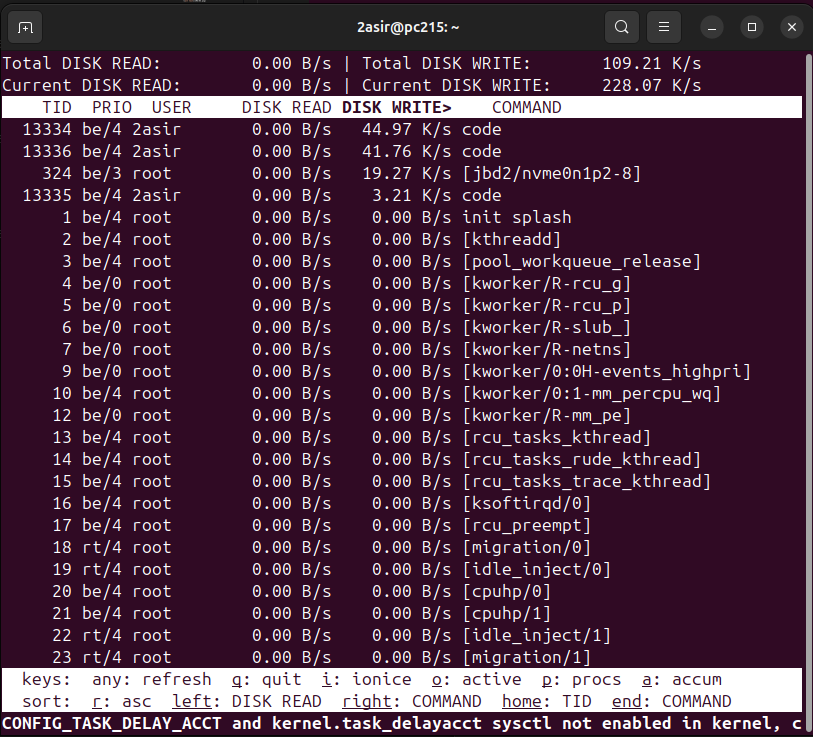

# Herramientas Propias del sistema
## Monitorización de procesos
* **ps -au**:  Ver todos los procesos de manera detallada
    * -a: todos los procesos de usuario
    * u: informacion detallada 
    * -C `<programa especifico>`: info de proceso especifico
    * -x: info de los demonios
    * -o `<cabeceras de procesos>`: permite alterar que columnas muestra
    * -e: muestra todos los procesos
    * --sort `[-/+<cabecera>]`: orden de salida

***Nota: añade  `| head -n <num>` para filtrar cuantos procesos aparecen;***

* **top**: se maneja en vivo pulsando botones.
    * -b > `<>`:no interactivo, guarda en un fichero
    * -n `numero`: itera `numero` veces
    * -o `[-/+<cabecera>]`: ordena por cabecera.

        ***Nota: top -b -n3 -o -%CPU | head -n 17. Filtra por uso de cpu*** 

* **htop**: mucho mas grafico, se controla de manera interactiva.
* **atop**:
* **jobs**: muestra lo que esta en segundo plano.
* **kill -9  `<id_proceso>/%<idproceso>`**: mata proceso, % mata los que se muestre en jobs.
* **pkill `<nombre_proceso>`**: mata todos los procesos con ese nombre

***Nota: ejecutar comando con '&' lo ejecuta en segundo plano;***

---

## Monitorizacion de red
* **tcpdump -i `<nic>`**: saca info que transite por la interfaz seleccionada 
    * -v: da mas informacion, "verbose".
    * -w `<diectorio>`: manda la infoa directorio en vez de por pantalla.
    * -r: para leer el directorio encriptado. Los saca perteneciendo al usuario tcpdump.

* **tcptrack -i `<nic>`**: igual que tcpdump, pero mas claro.

* **iptraf**: se instala con iptraf-ng, paquete muy intuitivo para revisar trafico en red, entre otras opciones.

* **bmon**: paquete intuitivo para monitorizar trafico. 

* **ss**: ver puertos
    * -tnl: puertos escuchando
    * -tnp: puertos establecidos

---

### Monitorización de Memoria
* **free -h**: Muestra el uso de memoria RAM y swap en un formato legible.

* **vmstat <intervalo>**: Muestra estadísticas de memoria, CPU y disco en intervalos de tiempo.
    * Ejemplo: `vmstat 2` muestra estadísticas cada 2 segundos.

---

### Monitorización de Disco
* **df -h**: Muestra el uso de espacio en disco por partición en un formato legible.

* **du -sh <directorio>**: Muestra el tamaño de un directorio específico.

* **iotop**: Monitorea el uso de Entrada y Salida en disco por procesos. Lo muestra en tiempo real similar a htop:

[⬅️ Volver al índice](./Index.md)
[⬆️ Volver al README](/README.md)
