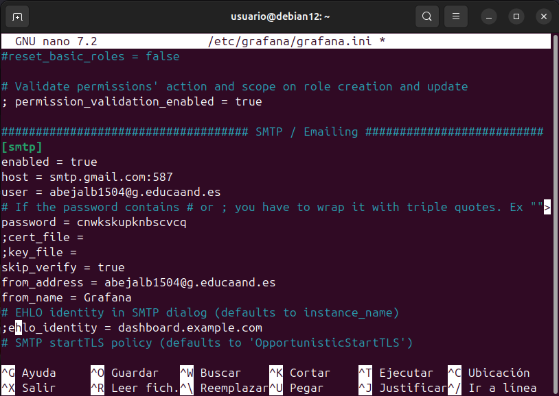
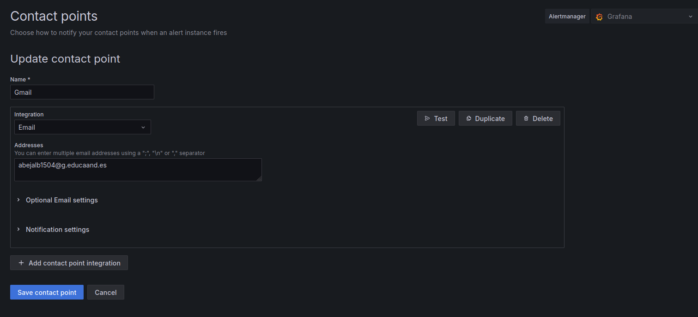

# Practica alerta grafana

1. Activar verificacion en 2 pasos de gmail.
2. Crear contraseña de aplicacion.
3. nano /etc/grafana/grafana.ini ctrl+w=smtp

4. systemctl restart grafana-server

5. Grqafana > aletrs > contact ponts

[⬅️ Volver al índice](./Index.md)
[⬆️ Volver al README](/README.md)
