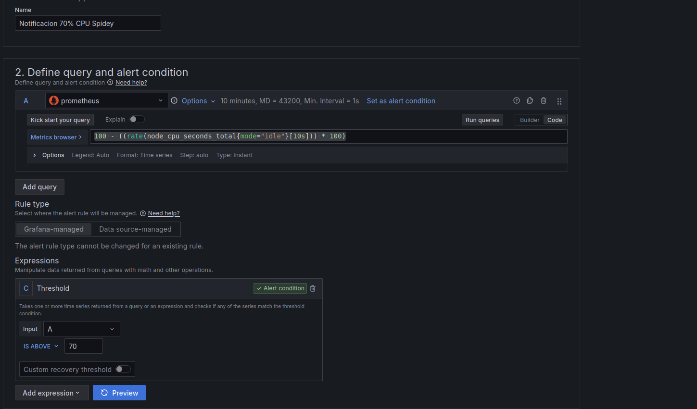

# Integración Grafana-Discord para la notificación de alertas

## Requsitos previos

* Una maquina con prometheus y node exporter
* Una maquina con grafana prevuamente conectada al servidor con prometheus
* Una cuenta en discord
* Un servidor de discord en el cual tengas permisos de administrador.

## Implantación

1. Vamos a discord > Nuestro  servidor > Ajustes del servidor > Integraciones > Webhooks y creamos un nuevo webhook.

Una vez hecho esto pulsamos en "Copiar URL del Webhook".

2. Creamos un nuevo contact point en Grafana y seleccionamos la integración con Discord, añadiendo el link copiado en el paso anterior al campo "Webhook URL".

Una vez terminamos guardamos el contact point.

3. Aún en Grafana nos dirigimos a Alerting > Alert rules y creamos una nueva regla.

A esta le añadimos las siguientes configuraciones:

Esto configurará una alerta que enviara una notificación a nuestro servidor de discord cuando el uso de la cpu supere el 70%.

## Pruebas de rendimiento

En este paso estresaremos la maquina con Prometheus para comprobar el correcto funcionamiento de la alerta.

1. Nos conectamos a la maquina por SSH y introducimos el siguiente comando:

`stress --cpu $(nproc --all) --vm 1 --vm-bytes 1G --vm-hang 1m`

Esto estresara a la cpu

2. Desde los paneles de monitorización comprobamos que esta subiendo el uso de la cpu en el gauge.

3. Esperamos un poco y veremos que se esta cumpliendo la condición de la alerta. (Aparecerá *Firing* en rojo si es el caso)

4. Pasado otros 10 segundos, como hemos configurado, veremos la notificación saltar en Discord.

