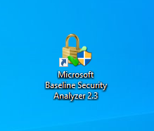
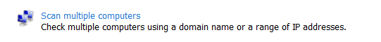
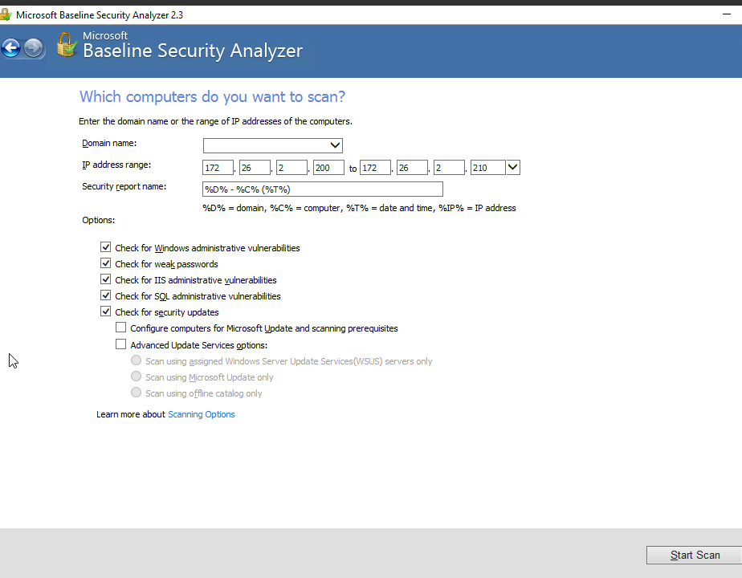
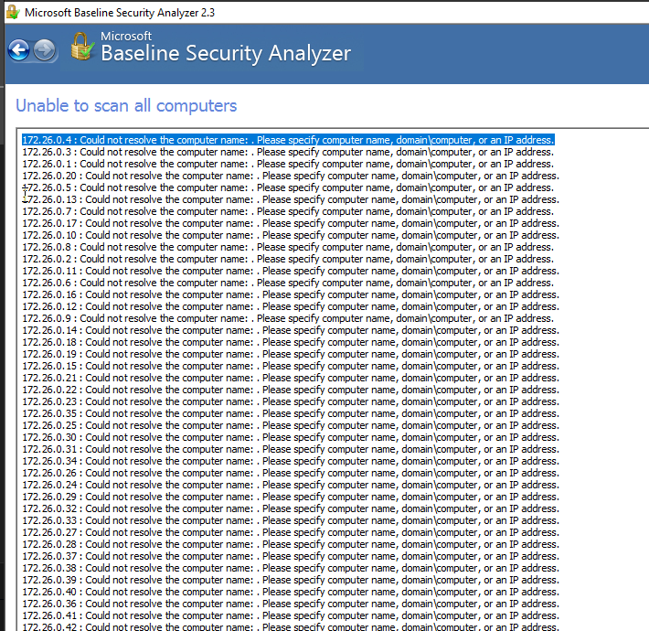
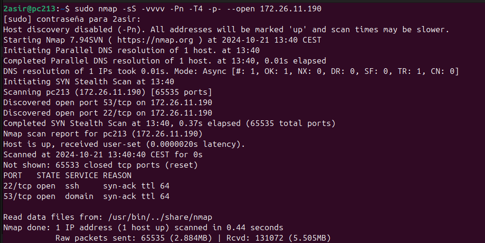

# Buscando vulnerabilidades (MBSA 2.3 y NMAP)

# 01.- Microsoft Baseline Security Analizer
## Requerimientos

* **Windows de 7 a 10**
* **Microsoft Baseline Security Analizer (MBSA) 2.3**

## Escaneo con MBSA

**1. Abre la aplicación**

**2. Selecciona La opcion de escanear varios ordenadores.**

**3. No selecciones un dominio y determina el rango de IP en las que analizar vulnerabilidades**

## Resultados

No se consiguieron encontrar dispositivos windows en ese rango de IPS

# NMAP
## Requerimientos

* **Sistema operativo linux**
* **Tener nmap instalado** *(apt install nmap)*

## Escaneo a ordenador propio con nmap

1. Abre un terminal
2. Ejecuta el siguiente comando
    ~~~bash
        nmap -sS -vvvv -Pn -T4 -p- --open <tu_ip>
        # o
        sudo nmap -sV --script vuln <tu_ip> ## Te dice posibles vulneravilidades
    ~~~
    * nmap: Es la herramienta que estás utilizando para realizar el escaneo. Nmap es una herramienta de escaneo de redes que permite descubrir hosts y servicios en una red.

    * -sS: Realiza un escaneo SYN o escaneo sigiloso. Este tipo de escaneo es menos detectable porque solo envía paquetes SYN (inicio de conexión TCP) y no completa el proceso de establecimiento de la conexión (TCP handshake).

    * -vvvv: Activa el modo de verbosidad con 4 "v", lo que significa que recibirás una salida muy detallada del escaneo.

    * -sV: detecta servicios en puertos abiertos y sus versiones.

    * -Pn: Indica a Nmap que ignore el ping para verificar si el host está activo o no, y procede con el escaneo directamente, útil si el ping está bloqueado por firewall.

    * -T4: Establece la velocidad del escaneo. T4 es una velocidad rápida adecuada para la mayoría de redes y sistemas, aunque puede ser más fácil de detectar por sistemas de detección de intrusiones.

    * -p-: Escanea todos los puertos (del 1 al 65535). Si no se especifica este parámetro, Nmap solo escanearía los 1000 puertos más comunes.

    * --open: Este parámetro muestra solo los puertos que están abiertos, ocultando los que están cerrados o filtrados.

    * <tu_ip>: Aquí debes reemplazar <tu_ip> con la dirección IP o el dominio del objetivo que deseas escanear.

## Resultado

### Resumen del escaneo Nmap:

- **IP escaneada**: 172.26.11.190
- **Host está activo**.
- **Puertos abiertos**:
  - **22/tcp**: Servicio SSH
  - **53/tcp**: Servicio DNS (Domain)
- **Puertos cerrados**: 65533
- **Tiempo total del escaneo**: 0.44 segundos

Este escaneo muestra que el host tiene abiertos los puertos 22 (SSH) y 53 (DNS), mientras que el resto de los puertos están cerrados.

[⬅️ Volver al índice](./Index.md)
[⬆️ Volver al README](/README.md)
