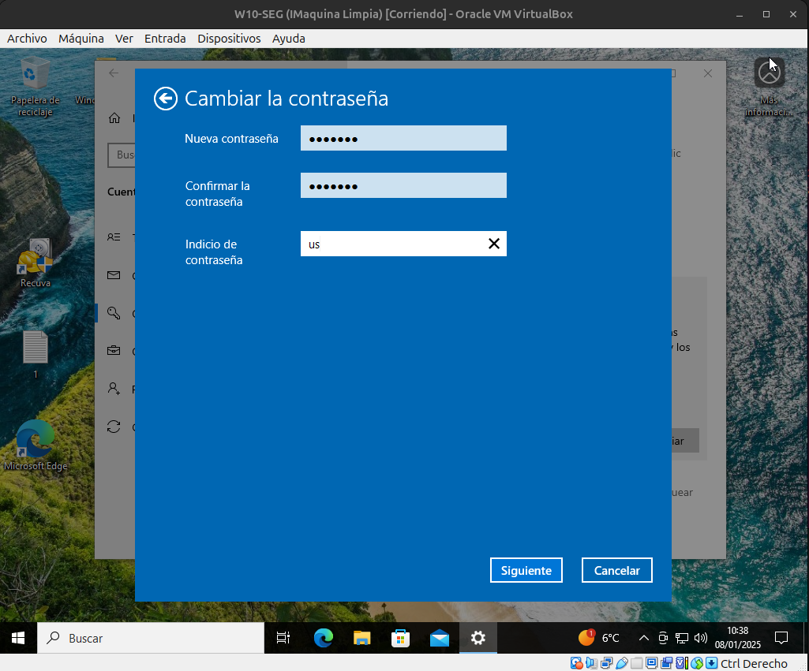
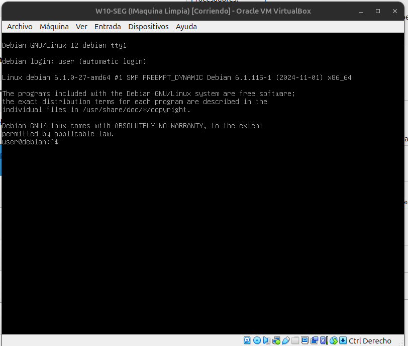
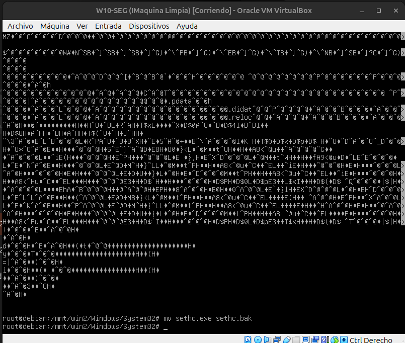
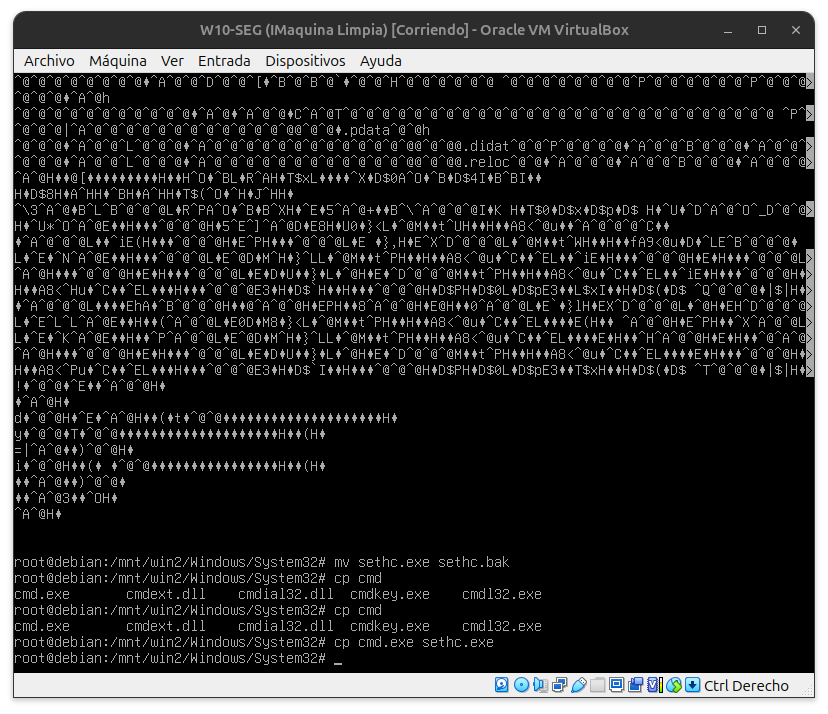
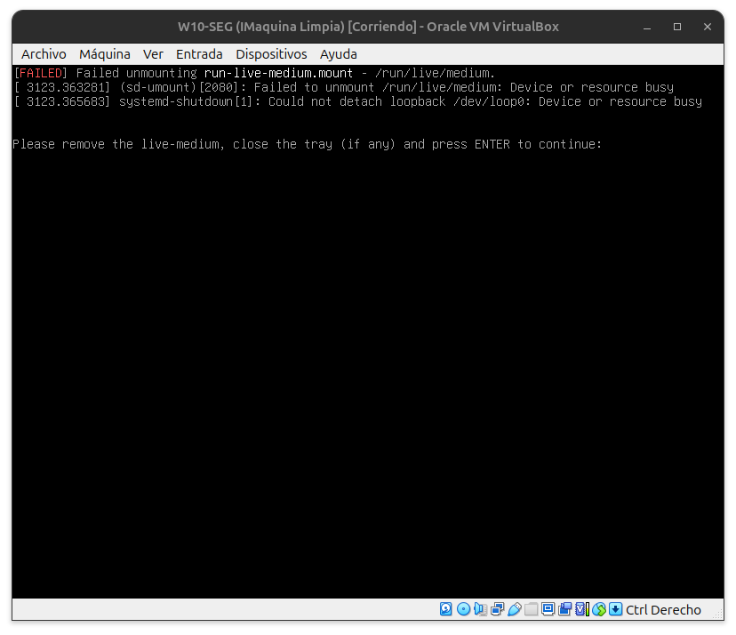

# T1. Modificación de contraseñas Windows

1. Arranca tu máquina virtual de Windows 7 y establece en ella una contraseña para el usuario que estés utilizando.

2. Apaga la máquina y vuelve a arrancarla con la iso del LIVE-CD.

3. Una vez hayas arrancado con el LIVE-CD, accede al disco duro que contiene el Windows 7, localiza el fichero sethc.exe y cámbiale el nombre (setch.bak por ejemplo).

4. Busca el fichero cmd.exe, haz una copia del mismo en la carpeta donde estaba el archivo sethc.exe y cámbiale el nombre cmd.exe por sethc.exe.

5. Apaga la máquina virtual.

6. Arranca la máquina virtual ya desde su disco duro original (sin la imagen iso del LIVE-CD).

7. Cuando el sistema te solicite el nombre de usuario y contraseña, pulsa 5 veces la tecla SHIFT y te deberá aparecer una consola de comandos.

8. En la consola de comandos, teclea el comando "control userpasswords2" (o también puedes usar el comando "netplwiz"), que abrirá la utilidad de configuración de contraseñas de usuarios, permitiéndote realizar operaciones con los usuarios del sistema y sus contraseñas (como borrarlas) o incluso añadir usuarios nuevos con permisos de adminstrador.

9. Prueba a eliminar la contraseña del usuario del sistema.

10. Apaga la máquina y arráncala de nuevo. Podrás acceder al sistema sin tener que teclear contraseña alguna.