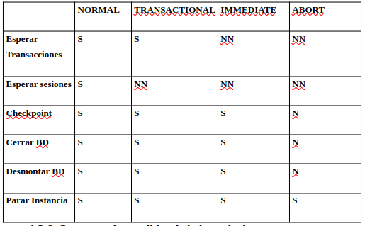
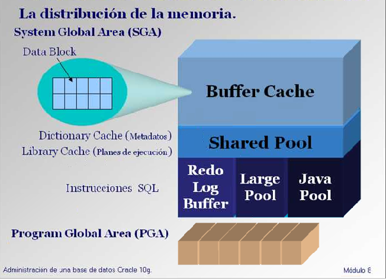

# 01_Arquitectura de oracle

## Perspectiva logica de la BD

Con la base de datos creada habrá algunos archivos fisicos que se podran ver, esto es la perspectiva fisica.

Usando SQLPLUS, los objetos de la bd que veremos son tablas, vistas y procedimientes, la perspectiva logica de la BD, esta nace de una lectura de la fisica.

### Distribucion de schemas

- Los objetos son propiedad de los usuarios que los creo.
- Todos los objetos creados por un usuario forman un esquema.
- El nombre del esquema es el del usuario.
- Nombres de los objetos en el esquema:
  _ Tenemos que referirnos a ellos por el nombre del usuario que los creo.
  _ Ejemplo:
  ~~~sql
  select columna from usuario.tabla;
  ~~~
  Ver objetos, ejemplo:

```sql
--Cuáles son las columnas de la tabla del sistema OBJ$ cuyo nombre = EMP
Select name from COL$ where obj# in (select obj# from obj$ where name ='EMP');
```

### Esquemas y repositorios

- El usuario SYS tiene propiedad de los objetos de diccionarios y es propietario de los schemas.
- Todos los objetos se distribuyen en esquemas
- El objetivo es diferenciar el punto de vista logico cn los repositorios o sub-BDs.
- Estos ultimos poseen sus squemas y usuarios.
- Permite tener varias aplicaciones usando las mismas tablas pero en squemas diferentes segun permisos.
- Todos los objetos son propiedad del user que creo el Objeto.
- La distribucion en schemas permite la separación administrativa de la BD.

## Diccionario de la base de datos

### Metadatos

Al crear una tabla hay que definir todos sus componentes, con sus tipos de datos, restricciones, propietario, etc...

Esta informacion se les llama metadatos y contienen la definicion de la estructura de los objetos

Los metadatos es de lo que se compone el diccionario en la BD.

### Tablas del sistema

Son tablas del squema de sys y se crean en el momento de creacion de la base de datos.

Estas tablas nos permiten crear mas informacion dentro de la base de datos, no deben de ser alteradas.

### Vistas del diccionario

El diccionario de datos esta compuesto por los metadatos, en resumidas cuentas son datos sobre los datos.

En el diccionario se describe la BD:

- De manera fisica.
- De manera logica.
- El contenido.
- Información de supervision del rendimiento

Tambien contiene desde la version 10 de oracle:

- Definiciones de usuario.
- Seguridad de la informacion.
- Restricciones de integridad.

El diccionario se almacena en un conjunto de segmentos en los Tablespaces SYSTEM y SYSTEMAUX.

**_Tablespace: Unidad logica de almacenamiento en una BD de oracle. Sirve como puente entre el sistema de ficheros del SO y la BD._**

Los segmentis que componen un diccionario son como los demas en la bd, tablas e indices, la unica diferencia es que estos datos no permiten el acceso directo, en caso de que los datos se alteren se pueden causar daños.

La creación del diccionario es pase del proceso de creacion de la DB, tambien se crean entradas al realizar CREATE TABLE/USER o GRANT.

#### Clases de vistas:

- Vistas de rendimiento:

  - Proporcionan info de funcionamiento de la BD
  - Hay mas de 300
  - Son referenciadas con los prefijos $V y $GV.
  - Estan siendo constantemente actualizadas por oracle.
  - Son esenciales para realizar diagnosticos de rendimiento.
  - Ejemplos de vistas:

  ```sql
  desc v$instance; --(no hace falta; instrucción sqlplus);
  select status, instance_name from v$instance;
  desc v$database; --información de la base de datos a la que estamos conectada
  ```

- Vistas estructuradas de objetos:
  - Permiten acceder a las tablas del diccionarios y conocer datos estructurales.
  - Estas tablas son conocidas como estaticas.
  - Sollo cambian con ciertos eventos transaccionales.
  - Se categorizan en tres grupos:
    - DBA\_: info sobre tablas
    ```sql
    SQL>Desc dba_tables; --Todas las tablas que hay en esta base de datos.
    SQL>Select * from  dba_tables; --En esta vista encontraré toda las tablas de las base de datos. Sólo lo puede usar un usuario que sea dba.  Para cada objeto habrá un dba, dba_index…
    SQL>Desc dba_views; --Vistas de todas las base de datos.
    --El primer campo es owner, el propietario.
    ```
    - User\_: Puede ejecutarlo cualquier usuario, pero solo veran las entradas que sean de su propieded
    ```sql
    --Nos conectamos como Scott.
    --Tiene acceso a su vista user_tables.
    Desc user_tables
    --Observad que no tiene el campo owner porque todo es de propiedad de Scott.
    Select table_name from user_tables: --Salen los que sean propiedad de él.
    ```
    - ALL\_: Sirve para ver aquellos objetos que eres propietario y objetos sobre los que tienes permisos.
  - En sqlplus hay una vista dictionary que nos puede ayudar.
  ```sql
  Desc dictionary; --Dentro de dictionary quiero encontrar algo sobre columnas
  Select table_name from dictionary where table_name like ‘ %COLS%’; --Me encuentra todas las vistas All_tab_col
  ```

## Instancias

Una instancia de una base de datos es el conjunto de procesos y memoria que maneja el acceso a los datos de la base de datos en un sistema de gestión de bases de datos (DBMS).

En términos simples:

- Instancia: Es el software en ejecución y los recursos (como la memoria y procesos) que gestionan y permiten el acceso a los datos.

- Base de datos: Es el almacenamiento físico de los datos, donde se guardan las tablas, índices y otros objetos de datos.

### Archivos de la BD

- PFILE: consiste en un texto plano que contiene parametros esenciales de inicio de la BD.
  - Parametros importantes:
    - Nombre y dominio de la BD
    - Ficheros de control de la BD.
    - Parametros de procesos: importante para inicio y espacio de memoria.

```sql
CREATE PFILE='<pfile location>' FROM SPFILE = '<spfile location>';
```

- Control Files: Almacenan info en un binario para mantener y verificar la integridad de la bd:

  - Estructura.
  - Nombre.
  - Fecha de creacion de BD.
  - Nombre fichero de datos y de redo log.
  - Info de Sincronización (estado de ficheros, tiempo de cierre,...)

- Data Files

  - Diccionario de datos
  - Objetos de usuarios
  - Imagen anterior de los bloques de datos antes de una transaccion (rollback).
  - Estan divididos en bloques:
    - Un bloque es la unidad minima de info(2-4-8K)
    - Los ficheros se organizan de manera independiente al SO.
    - El primer nloque almacena info de control no almacenan datos (Cabecera del fichero)
  - Para obtener info de los ficheros de datos se consulta DBA_DATA_FILES

- Archivos de registro para rehacer (REDO LOG FILES)
  - Graban todas las modificaciones que sufre la base de datos
  - Funcionan circularmente y se sobrescriben, mínimo debe existir uno.
  - Se recomienda trabajar en varios discos y ficheros (Multiplexados)
  - Son n grupos de n miembros a modo de espejo y en discos distintos.
  - Son de acceso secuencial, por lo que interesa ponerlos en dispositivos rápidos.
  - Se graban al hacer COMMIT o cuando se llena el buffer a un tercio
  - Encontramos información sobre ellos en V$LOGFILE y V$LOG.

Los DATA FILES Y REDO LOG FILES son los que contienen la
esencia de la base de datos, toda la información de la base de datos.

Los CONTROL FILES contienen la lista y ubicación de DATA
FILES y REDO LOG FILES. Si perdemos los CONTROL FILES
perdemos la manera de encontrar los DATA FILES.

Voy a la carpeta c:\app\oracle\oradata\mi_BD.

- .Log: redo log files.
- .Dbf: los datos.
- .Ctl: Los control files.

### Iniciar y Detener la instancia

#### Fases del proceso de inicio

1. Iniciar la Instancia: Reserva memoria y espacio para la instancia, tambien inicializa procesos, para esto se llama al PFILE, tembien se inicia el Area Global del Sistema(SGA), los procesos background y se abre el fichero alert$ORACLE_SID.log.

2. Montado de la BD: Se leen los **Control Files**.

3. Apertura de la BD: Se leen los **DATA FILES** y **REDO LOG FILES**, bloqueandolos, en este punto los usuarios ya pueden acceder a la BD. El servidor Oracle comprueba la consistencia de los datos
   y si es necesario el proceso SMON inicia la recuperación de la
   instancia.

Al tener Instalado un servidor Oracle y una instancia el equipo realiza estos tres pasos por si solo.

Modos de inicio

- NOMOUNT: Inicia la instancia sin montar la base de datos, útil para ciertas operaciones de mantenimiento (como creación de base de datos).
- MOUNT: La instancia se inicia y se monta la base de datos (se leen los archivos de control), pero no se abre. Este modo se utiliza para tareas como la recuperación de la base de datos.
- OPEN: La base de datos se abre y está lista para ser utilizada por los usuarios.

```sql
-- Iniciar la instancia en modo NOMOUNT
STARTUP NOMOUNT;

-- Montar la base de datos (lectura del archivo de control)
STARTUP MOUNT;

-- Abrir la base de datos (disponible para los usuarios)
STARTUP;

-- Detener la instancia
SHUTDOWN immediate;

```

### Inicio Paso a paso de la Bd

```sql
-- Iniciamos la instancia
startup nomount;

-- La montamos
Alter database mount;

---La abrimos, podemos añadir la clausula pfile para indicar cual ora usar en la inicializacion.
Alter database open [pfile='<pfile_location>'];
```

Si hay errores en el PFILE fallarán en la fase 1, si hay errores en control file en la fase 2 y si hay problemas o errores en control files o redo log files el problema aparecerá en la fase 3, la fase de apertura
de la base de datos.

### Detener la Instancia

~~~sql
-- Espera a que termine todas las transacciones en curso y todas las sesiones, se fuerza a un Checkpoint (Proceso lanzado temporalmente cada tres segundos. Provoca una sincronización de lo que hay en memoria y el disco), además de cerrar todos los ficheros y parar o destruir la instancia.

Shutdown normal;

-- Si no podemos avisar a los usuarios previamente. Nadie puede iniciar y las conexiones vigentes sufrirán un rollback. Cierra todas las sesiones; cierra y desmonta la BD, además de forzar un checkpoint, cierra ficheros y para la instancia.

Shutdown immediate;

--s similar al anterior, no deja iniciar nuevas transacciones, pero a diferencia esperará que las transacciones que estén en curso terminen, fuerza un checkpoint, cierra los ficheros y destruye la instancia.

Shutdown transactional;

-- No usar, salvo que no funcionen las demás. Nos pedirá luego recuperación. Ni se deshacen las transacciones ni se esperan que se termine ni nada. El estado cuando se vuelve a levantar la base de datos, no es apropiado y exigirá recuperación (lo hace automáticamente el proceso SMON). Cierra la instancia (destruye procesos Background y SGA) sin esperar  a desmontar ni cerrar la BD (como en una “caída, ni hace checkpoint ni cierra ficheros).

Shutdown abort;
~~~


### Otros estados de la BD
* Solo lectura: En este estado ni los datafiles ni los redo log files se abrirán para escritura.
    ~~~sql
    startup nomount;
    alter database mount;
    --La abrimos en modo lectura, permitiendo solo visualiacion, pero ninguna alteracion de los datos.
    alter database open read only;
    ~~~
* Acceso restringido: Accesible solo para administrativos (sys y sysoper).
    ~~~sql
    -- Inicia en modo restringido
    Startup restrict [pfile='direccion/de/pfile'];

    -- Deshace el modo resirngido
    alter system disable restricted session;
    -- Rehace si fuese necesario.
    alter system enable restricted session;
    ~~~

* Quescied: Estado *Silencioso* de Oracle, solo los administradores pueden realizar operaciones, permite realizar transacciones activas en el momento.
    
    **_Hay que abrir 2 terminales._**

    En uno entras como sys e introduces:
    ```sql
    alter system quiesce restricted;

    --Voy al otro terminal:
    alter system uniquiesce;

    --Suspender bd
    alter system suspend;

    --Ver estado de bd
    select database status from v$instance;

    --Continua BD, usa el terminal abierto
    alter system resume;
    ```
    En la modalidad quiesce restricted, todas las sesiones que estén corriendo, completan su tarea actual, en el punto que se convierten inactivos en v$session, no pueden ejecutar ninguna setencia SQL mas hasta que el sistema esté unquiesced.

## Parametros

En el parameter file (PFILE) se encuentran los parametros de inicialización de la BD.

Aqui vienen asignados aaspectos como espacio de memoria, ubicación de archivos, etc...

### Modificar parametros
Hay que ver si son dinamicos o no.

Processes y sessions son staticos, no se pueden editar mientras la instancia esta en marcha.

```sql
show paramter sessions;
show paramter processes;
```

La diferencia es que los dinamicos si son editables en ejecución.

```sql
show paramter job_queue_processes; --Enseña el valor actual (1000)
alter system set job_queue_processes=900; --Lo modifica al 900
```

Los cambios no se quedan entre ejecuciones y al levantar la bd se resetea.

Puedes cambiar los metodos de cambio en el propio comando en este caso spfile. Hay que revisar siemre cual es el que tienees por defecto, en mi caso es siempre spfile, por lo que lo omitiré.

```sql
alter system set job_queue_processes=5 scope=spfile;
```

Para tocar los staticos como processes, tienes que alterar el **.ora** que configura los paramatetros a la hora de lanzar la bd.

Despues hay que apagarla y relanzarla. Al entrar tendra el parametro cambiado.

```sql
shutdown immediate;
--Alteras el .ora
startup pfile=c\app\oracle\admin\init.ora; --En mi caso
show parameter processes;
```

### Server Parameter File (spfile)

Archivo de parámetros del lado del servidor. Guardado en formato binario, no en texto plano. 
Ventaja: Permite mantener los cambios de los parámetros dinámicos. Cuando se inicia la instancia hay que indicarlo con SPFILE. Archivo de parámetros del lado del servidor.

#### Creacion SPFILE
~~~sql
-- Proceso de creación
shutdown immediate -- En caso de tener la instancia activa.

Create Spfile  from pfile =c:\app\oracle\admin\prueba\pfile\init.ora
~~~

#### Comprobar si trabajamos con SPFILE
~~~sql
--¿Cómo puedo comprobar si estoy trabajando con spfile?
show parameter spfile;
-- Cierro la instancia.  Abro sin indicarle el pfile.
Shutdown immediate;
startup open;
show parameter spfile;

--Si modifico un parámetro como :
alter system set job_queue_processes=5 scope = Spfile/Memory/Both;
~~~

##### Valores posibles del campo scope: 
* Memory: Sólo ahora
* spfile: Las próximas veces.
* Both: Ahora y las proximas veces.

## Arquitectura de una Instancia Oracle

El administrador debe comprender la arquitectura del server:

* BD = Instancia + Ficheros de BD
* Instancia = Estructuras de memoria + Procesos
* Ficheros de la BD = Data File + Control File + Redo Log File

### Distribución de memoria

#### System Global Area/Shared Global Area (SGA)
* Estructura de memoria compartida
* Area de memoria, contiene datos e info de control del server.
* Oracle asigfna la memoria a la SGA cuando la instancia arranca, se libera al pararse.
* Cada Instancia tiene su propio SGA.

***SGA = DB Buffer Cache + Shared Pool + Redo Log Buffer***

**Componentes**:

* **Buffer Cache**: 
    * Zona de memoria destinada a info consultable o modificable.
    * Todas las lecturas y escrituras pasan por aqui.
    * Estructura de bloques de datos
    * Se ha de definir el tamaño por bloque de 2k a 64k, importante al ser indivisible.
    * En caso de falta de almacenamiento, el buffer cache es lo primero que se limpia. (Borra primero lo que no se ha usado recientemente)
* **Shared Pool**:
    * Consiste en el area de memoria donde se guardan los metadatos.
    * Se divide en dos:
        * Dictionary caché: donde se meten los metadatos directamente.
        * Library Caché: Se guardan planes de ejecucion realizados con anterioridad een la sesion, asi se acceden a los mismos mas rapido en la siguiente ejecución.
* **Redo Log Buffer**:
    * Se almacena el historico de cambios (insert, delete, update).
    * Con esto se crean **redo entries** lo que nos permite volver a un estado anterior de la BD.
    * Proporcionan seguridad frente a la caida de la BD.
    * El tamaño se decide en el parametro LOG_BUFFER.

La SGA se gestiona por el algoritmo LRU (Last Recently Used), eliminando datos de la memoria en orden de menos reciente usado a mas reciente usado.

Se puede visualizar:
~~~sql
show sga;
select * from V$SGA;

-- Si tenemos que vaciarla entera podemos:
ALTER SYSTEM FLUSH SHARED POOL;
~~~

**Otras areas Opcionales**:
* **Large Pool**:
    * Se usa para grandes volcados de info.
    * Permite mover hacia el disco grandes cantidades de info, backups y recuperaciones.
* **Java Pool:**
    * Se usa en caso de que la BD permita usar codigo Java.
    * Lo da oracle
    * No necesitas de java Runtime ara ejecutar codigo en un servidor oracle.

**Parametros que afectan al tamaño de la SGA**:
* **DB_Block_Size**: 
    * Se define al inicio del la creacion de la BD.
    * Invariable
     ~~~sql    
     show parameter DB_BLOCK_SIZE;
     ~~~
* **LOG BUFFER**:
    * Decide el tamaño de la memoria del SGA en el **REDOLOG BUFFER**
     ~~~sql    
     show parameter LOG_BUFFER;
     ~~~
#### Program Global Area (PGA)

* No se reserva en inicio de instancia como SGA
* Es un area Variable (gestiona variables y cursores)
* Cree para cada usuario y decrece en su cierre de sesión.
* Completemente separado de SGA.

***Nota: antes de a version 10 de Oracle Server el admin tenia que asignar la memoria manualmente, pero ahora es automatico***


**Esquema grafico**


## Procesos de Oracle
### Procesos Usuario:
* Se crea cuando un usuario se conecta a la BD.
* Atiende a peticiones lanzadas por el Usuario.


[⬅️ Volver al índice](./Index.md)
[⬆️ Volver al README](/README.md)
