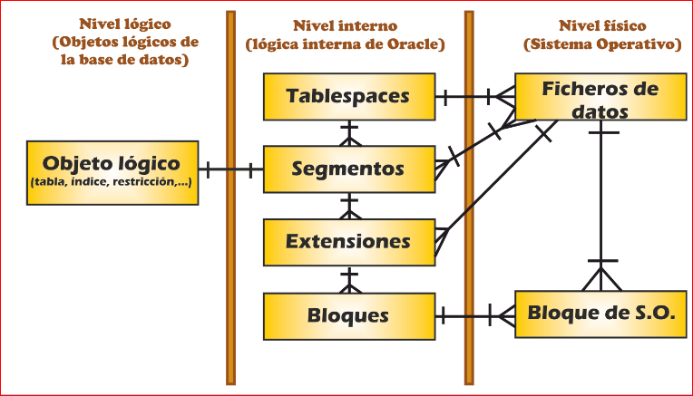

# Creacion y uso de Indices

Los indices se cran para reducir tiempos de respuesta, afectando de gran manera al rendimiento.

Se definen sobre una columna o conjunto dde columnas de una tabla concreta, Se suelen crear en claves primarias o con restricciones de uniciad.

Deben crearse en periodos de bajo uso de la BD y no  debe estar en el mismo disco de la tabla.

### Se crean cuando: 
* **Hay muchas consultas realizadas en esa columna.**
* **Hay muchas consultas en columnas asociadas.**
* **La tabla es muy grande.**

### No es recomendable:
* **Valores repetidos o nulos en la columna**
* **Tabla pequeña**
* **Hay muchas inserciones, modificaciones y borrados.**

## Clausulas de almacenamiento

La creacion de tablas se compplica: 
~~~sql
CREATE TABLE nombretabla
    (columnas y restricciones)
STORAGE
    (claúsulas de almacenamiento)
TABLESPACE nombre_ts;
~~~

### Tipos de claúsulas de almacenamiento:

* **INITIAL**: (tamaño extensión inicial) (en K o M)
* **NEXT**: (tamaño 2ª extensión)
* **PCTINCREASE**: (porcentaje de incremento para la 3ª y siguientes),
* **MINEXTENTS**: (extensiones reservadas en principio)
* **MAXEXTENTS**: (número total de extensiones como máximo).

# Tablespaces

Un tablespace o espacio de tablas es una unidad lógica de almacenamiento de datos (una especie de carpeta que contiene tablas, índices, etc.) que se corresponde con uno o varios ficheros del sistema operativo (datafiles).

No deben mezclarse datos de distinta naturaleza en el mismo tablespace.

Al instalar ORACLE se crean varios tablespaces:

* **SYSTEM**: Se guarda el diccionario de datos y otros objetos del sistema. NO usar para guardar otras cosas.
* **SYSAUX**: Componentes opcionales de ORACLE
* **USERS**: Objetos de los usuarios.
* **TEMP**: Para guardar objetos temporales (sorts, productos cartesianos, etc...)
* **UNDOTBS01**: Segmento de ROLLBACK.

Se recomienda crear un tablespace por cada departamento de la empresa.

Si se desea liberar de carga el tablespace TEMP o UNDOTBS01 se pueden crear otros tablespaces temporales o de deshacer y repartir a los usuarios entre ellos.

Una sintaxis sencilla para crear un tablespace es la siguiente:

~~~sql
CREATE [TEMPORARY|UNDO] TABLESPACE nombrets
[DATAFILE|TEMPFILE] ruta_absoluta_fichero [SIZE nº [K|M]][REUSE][AUTOEXTEND ON [MAXSIZE n M]]
… (podemos añadir más ficheros separando con comas)...
[LOGGING|NOLOGGING]
[PERMANENT|TEMPORARY]
[DEFAULT STORAGE
(clausulas de almacenamiento)]
[OFFLINE];
~~~

### Comandos

~~~sql
--Para ponerlo OFFLINE (útil para restaurar o realizar ciertas operaciones):
ALTER TABLESPACE nombrets OFFLINE;
--Para añadirle otro datafile:
ALTER TABLESPACE nombrets
ADD DATAFILE …
--Para cambiar la ruta de un fichero:
ALTER TABLESPACE nombrets
RENAME DATAFILE nombre1 TO nombre2
--Para borrarlo:
DROP TABLESPACE nombrets [INCLUDING CONTENTS][AND DATAFILES];
~~~

## Bloque de datos, extensones y segmentos.

En ORACLE, un bloque de datos es la cantidad mínima de información que se puede recuperar de los dispositivos de almacenamiento.

Su tamaño debe ser múltiplo del bloque de disco definido en el sistema operativo anfitrión y se define con DB_BLOCK_SIZE.

Una extensión es un conjunto de bloques de datos contiguos reservados de una vez.

Un tablespace se divide en segmentos, uno para cada objeto existente en el tablespace.

El almacenamiento en un tablespace se puede gestionar por diccionario o localmente (en el propio tablespace). Esta última fórmula da mejor rendimiento, pero se ignora la claúsula STORAGE de los objetos del tablespace.

Existen cuatro tipos de segmentos: 
* **De tabla**
* **De índice**
* **Temporal**
* **De undo**

### Segmentos

Un segmento es aquel espacio reservado por la base de datos, dentro de un datafile, para ser utilizado por un solo objeto.

Físicamente, todo objeto en un base de datos, no es más que un segmento dentro de un datafile.

Un segmento está constituido por secciones llamadas extensiones, que son conjuntos contiguos de bloques Oracle.

Cuando todas las extensiones de un segmento se llenan, se reserva una nueva, buscando entre los distintos datafiles del tablespace alguno con suficientes bloques de datos libres contiguos.

### Extensiones

Las extensiones de un segmento no se liberan salvo que se haga un DROP del objeto correspondiente a dicho segmento, un ***TRUNCATE*** del objeto o un ***ALTER TABLE DEALLOCATE UNUSED***.

Las extensiones de un segmento no tienen porque ser contiguas, ni estar en el mismo disco.

### Esquema

## Gestion de espacio de tablas

Las vistas más útiles para gestionar el espacio de almacenamiento son:

* **DBA_TABLESPACES**: Descripción de todos los tablespaces.
* **DBA_TS_QUOTAS**: Cuotas de usuario en cada tablespace
* **DBA_DATA_FILES**: Información de los ficheros de datos.
* **DBA_FREE_SPACE**: Extensiones disponibles en cada tablespace.
* **DBA_EXTENTS**: Extensiones de cada segmento.
* **DBA_ROLLBACK_SEGS**: Segmentos de rollback
* **DBA_SEGMENTS**: Segmentos de cada tablespace.
* **DBA_TEMP_FILES**: Ficheros para los tablespaces temporales.

# Clusters

Un cluster de tablas es un objeto de la base de datos que almacena en un mismo área del disco varias tablas que contienen una o varias columnas en común.

Se usa mucho en caso de que un join se repita con mucha frecuencia porque aumenta su velocidad. 

Para que un cluster funcione debe tener un índice asociado.

~~~sql
--Para crear un cluster:
CREATE CLUSTER nombrecluster (columna tipo)
[TABLESPACE nombrets]
[STORAGE (claúsulas de almacenamiento)];

CREATE INDEX nombreidx ON CLUSTER nombrecluster;

--Para que una tabla se cree dentro de un cluster:
CREATE TABLE nombretabla
( lista columnas y restricciones)
CLUSTER nombrecluster(columnadelcluster);
~~~

# Secuencias

En ORACLE no existen los campos autonuméricos como tales, no obstante, puede crearse un objeto tipo secuencia que va generando números a medida que se necesiten.

La sintaxis es la siguiente:
~~~sql
CREATE SEQUENCE nombresec
[INCREMENT BY numero]
[START WITH numero]
[MAXVALUE numero]
[MINVALUE numero]
[CYCLE | NOCYCLE]
[ORDER | NOORDER];
~~~

Las secuencias tienen dos métodos: CURVAL y NEXTVAL que nos permiten utilizarlas.

Ejemplo de su uso:

~~~sql
CREATE SEQUENCE secuencia1;
INSERT INTO CLIENTES (codcliente, nombre)
VALUES (secuencia1.NEXTVAL, 'PEPE');
INSERT INTO CLIENTES (codcliente, nombre)
VALUES (secuencia1.NEXTVAL, 'JUAN');
codcliente debe ser tipo NUMBER.
~~~
Vista del diccionario de datos: DBA_SEQUENCES

[⬅️ Volver al índice](./Index.md)
[⬆️ Volver al README](/README.md)
