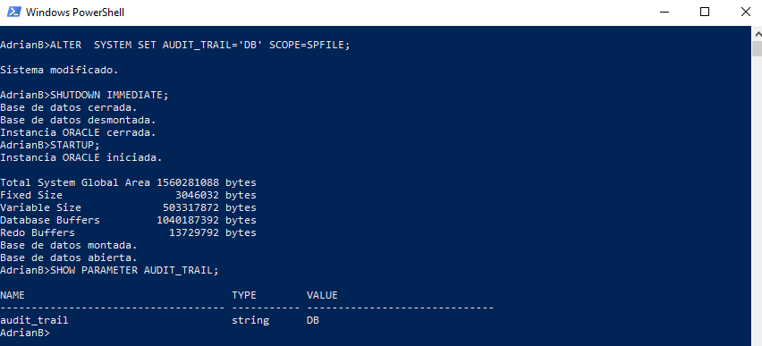

# Audiorías Oracle

Las auditorías se utilizan para realizar un seguimiento de todo lo que acontece en la base
de datos, seguimiento de las instrucciones SQL y seguimiento de los objetos y todas sus
operaciones. La base de datos admite la posibilidad de auditar todas las operaciones que
tienen lugar en ella. Los registros de auditoría pueden escribirse tanto en la tabla
SYS.AUD$ como en la pista de auditoría del sistema operativo. Esta segunda opción
depende del sistema operativo.

## 1
~~~ sql
ALTER SYSTEM SET AUDIT_TRAIL='DB' SCOPE=SPFILE;
SHUTDOWN IMMEDIATE;
STARTUP;
SHOW PARAMETER AUDIT_TRAIL;
~~~

## 2
~~~SQL
AUDIT INSERT,UPDATE ON SCOTT.NUEEMPLE;
SELECT * FROM DBA_OBJ_AUDIT_OPTS WHERE OWNER='SCOTT' AND OBJECT_NAME = 'NUEEMPLE';
~~~
