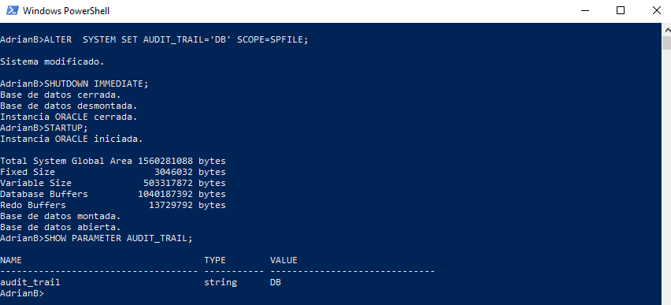
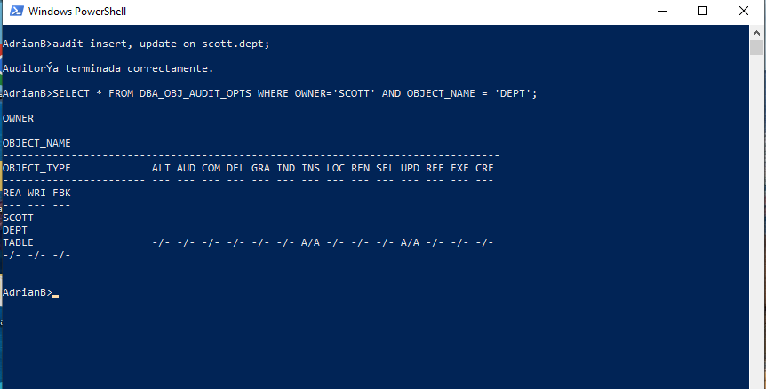
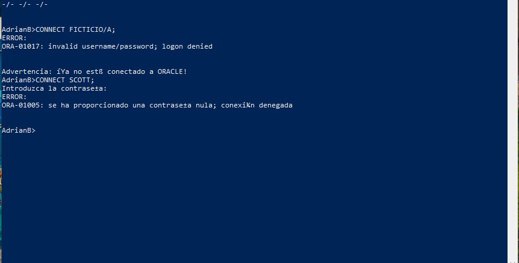
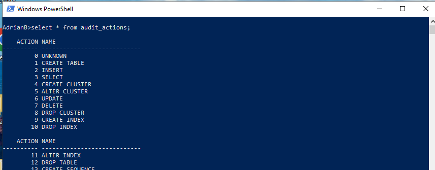
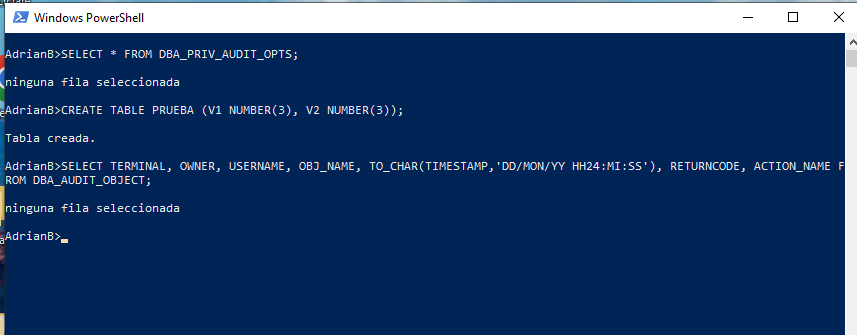

# Audiorías Oracle

Las auditorías se utilizan para realizar un seguimiento de todo lo que acontece en la base
de datos, seguimiento de las instrucciones SQL y seguimiento de los objetos y todas sus
operaciones. La base de datos admite la posibilidad de auditar todas las operaciones que
tienen lugar en ella. Los registros de auditoría pueden escribirse tanto en la tabla
SYS.AUD$ como en la pista de auditoría del sistema operativo. Esta segunda opción
depende del sistema operativo.

## 1
~~~ sql
ALTER SYSTEM SET AUDIT_TRAIL='DB' SCOPE=SPFILE;
SHUTDOWN IMMEDIATE;
STARTUP;
SHOW PARAMETER AUDIT_TRAIL;
~~~

## 2
~~~SQL
AUDIT INSERT,UPDATE ON SCOTT.NUEEMPLE;
SELECT * FROM DBA_OBJ_AUDIT_OPTS WHERE OWNER='SCOTT' AND OBJECT_NAME = 'NUEEMPLE';
~~~

## 3
~~~sql
CONNECT FICTICIO/A;
CONNECT SCOTT;
~~~

## 4

~~~sql
SELECT * FROM AUDIT_ACTIONS;
~~~

## 5

~~~sql
SELECT * FROM DBA_PRIV_AUDIT_OPTS;
CREATE TABLE PRUEBA (V1 NUMBER(3), V2 NUMBER(3));
SELECT TERMINAL, OWNER, USERNAME, OBJ_NAME, TO_CHAR(TIMESTAMP,'DD/MON/YY HH24:MI:SS'), RETURNCODE, ACTION_NAME FROM DBA_AUDIT_OBJECT;
~~~

## 6

~~~sql
 AUDIT INSERT ON SCOTT.NUEEMPLE;
---Abrimos una sesión con SCOTT e insertamos dos registros:
SQL> INSERT INTO NUEEMPLE VALUES (111,'PEPITO','ENFERMERO', 7839,'09/05/80',
2000.34,100.93,10);
SQL> INSERT INTO NUEEMPLE VALUES (222,'MARÍA','MÉDICO', 7839,'10/07/83',
2500.98,170.88,20);
SQL> COMMIT;
---Desde SYS comprobamos lo que ha ocurrido, y lo que ha hecho SCOTT, consultamos la hora y la acción realizada, utilizamos la vista DBA_AUDIT_OBJECT. USERNAME es el usuario que realiza la acción, y OWNER el propietario del objeto:
SQL> SELECT TERMINAL, OWNER, OBJ_NAME, TO_CHAR(TIMESTAMP,'DD/MON/YY
HH24:MI:SS'), ACTION_NAME FROM DBA_AUDIT_OBJECT WHERE USERNAME='SCOTT';
~~~